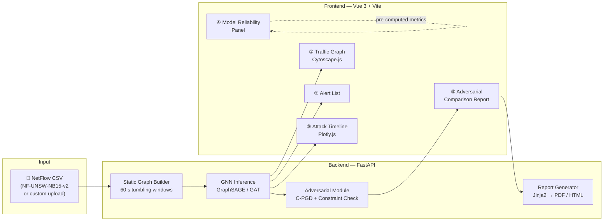

# GNN-TGAT-NIDS

**Upload NetFlow traffic → Detect intrusions with GNN → Visualize, alert, and report**

[](https://www.python.org/)
[](https://pytorch.org/)
[](https://vuejs.org/)
[](https://fastapi.tiangolo.com/)
[](LICENSE)

> An interactive web-based Network Intrusion Detection System powered by Graph Neural Networks.
> Upload a NetFlow CSV, explore the traffic graph, review alerts, and export a full security report — including adversarial robustness analysis.

---

## Features

| # | Feature | Description |
|---|---------|-------------|
| 🔵 | **Interactive Traffic Graph** | IP nodes + flow edges coloured by risk level. Click any node to inspect its connections and threat score. |
| 🔔 | **Alert List** | Per-flow alerts with attack type, confidence score, and the top features that triggered detection (via GAT attention weights). |
| 📊 | **Attack Timeline** | Stacked time-series showing attack-type distribution across 60-second windows. Spot bursts and campaign patterns at a glance. |
| 🛡️ | **Model Reliability Panel** | Pre-computed metrics answering "how trustworthy is this system?": clean F1, detection rate under adversarial attack, and improvement after adversarial training. |
| ⚗️ | **Adversarial Comparison Report** | Side-by-side view of original vs. adversarially-perturbed flows — which features changed, by how much, and whether all network protocol constraints are still satisfied. Exportable as PDF / HTML. |

---

## Architecture



---

## Quick Start

### Prerequisites

- Python 3.12+, [uv](https://docs.astral.sh/uv/), Node.js 20+
- CUDA 12.4+ (optional; CPU mode is supported for small datasets)

### 1. Backend

```bash
git clone https://github.com/SoWiEee/GNN-TGAT-NIDS.git
cd GNN-TGAT-NIDS

# Install Python dependencies
uv sync
uv run pip install pyg_lib torch_scatter torch_sparse torch_cluster \
    -f https://data.pyg.org/whl/torch-2.4.0+cu124.html

# (Optional) Run tests
uv run pytest
```

### 2. Pre-process demo dataset

```bash
# Download NF-UNSW-NB15-v2.csv from UNSW and place in data/raw/
uv run python src/data/static_builder.py --config-name static_default
```

### 3. Train models (or use pre-trained checkpoints)

```bash
uv run python train.py model=graphsage data=static_default
uv run python train.py model=gat data=static_default
```

### 4. Pre-compute model reliability metrics

```bash
# Runs clean eval + C-PGD attack eval + adversarial-training eval
# Saves results to data/metrics/reliability.json (loaded by the frontend)
uv run python scripts/compute_reliability_metrics.py
```

### 5. Frontend

```bash
cd frontend
npm install
npm run dev          # development server at http://localhost:5173
# or
npm run build && npm run preview    # production preview
```

The FastAPI backend starts automatically when the frontend makes its first request, or run it manually:

```bash
uv run uvicorn app.main:app --reload --port 8000
```

---

## Project Structure

```
GNN-NIDS-Analyzer/
├── src/                        # ML core (reused from GNN-TGAT-NIDS)
│   ├── data/
│   │   ├── loader.py           ← chronological split, label encoding
│   │   ├── static_builder.py   ← NetFlow CSV → PyG Data (tumbling windows)
│   │   └── static_dataset.py   ← on-demand PyG Dataset loader
│   ├── models/
│   │   ├── base.py             ← BaseNIDSModel ABC
│   │   ├── graphsage.py        ← 3-layer GraphSAGE edge classifier
│   │   └── gat.py              ← 4-head GAT with attention export
│   ├── attack/
│   │   ├── base.py             ← BaseAttack ABC
│   │   ├── constraints.py      ← TCP validity, co-dependency, bounds
│   │   └── cpgd.py             ← Constrained PGD (adversarial comparison)
│   └── utils/
│       ├── seed.py
│       └── checkpoint.py
├── app/                        # FastAPI application
│   ├── main.py                 ← app entry point, CORS, lifespan
│   ├── routers/
│   │   ├── analysis.py         ← POST /analyze
│   │   ├── adversarial.py      ← POST /adversarial
│   │   └── report.py           ← GET  /report/{session_id}
│   ├── services/
│   │   ├── inference.py        ← runs GNN on uploaded data
│   │   ├── graph_builder.py    ← builds Cytoscape.js JSON from PyG output
│   │   └── report_builder.py   ← Jinja2 → HTML → WeasyPrint PDF
│   └── templates/
│       └── report.html.j2
├── frontend/                   # Vue 3 + Vite
│   ├── src/
│   │   ├── views/
│   │   │   ├── TrafficGraph.vue
│   │   │   ├── AlertList.vue
│   │   │   ├── AttackTimeline.vue
│   │   │   ├── ReliabilityPanel.vue
│   │   │   └── AdversarialReport.vue
│   │   ├── components/
│   │   ├── stores/             ← Pinia stores
│   │   └── api/                ← axios API client
│   ├── package.json
│   └── vite.config.ts
├── scripts/
│   └── compute_reliability_metrics.py
├── configs/                    # Hydra configs
├── data/
│   ├── raw/                    ← place dataset CSVs here (git-ignored)
│   ├── processed/              ← built by static_builder (git-ignored)
│   ├── demo/                   ← curated 1000-flow demo CSV (tracked)
│   └── metrics/
│       └── reliability.json    ← pre-computed F1 / DR / ΔF1
├── checkpoints/                ← pre-trained model weights (git-ignored)
│   ├── graphsage_best.pt
│   └── gat_best.pt
├── tests/
├── docs/
│   └── spec.md
├── pyproject.toml
└── README.md
```

---

## Demo

> **Try with the included demo dataset** (1 000 flows, subset of NF-UNSW-NB15-v2):
>
> ```bash
> cp data/demo/demo_flows.csv data/raw/demo_flows.csv
> # then follow Quick Start steps 2 → 5
> ```

*Screenshots / demo video — coming in Phase 2*

---

## Model Reliability (Pre-computed on NF-UNSW-NB15-v2 test split)

| Metric | GraphSAGE | GAT |
|--------|:---------:|:---:|
| Weighted F1 (clean) | TBD | TBD |
| DR@attack — C-PGD ε=0.1 | TBD | TBD |
| ΔF1 after adversarial training | TBD | TBD |

*Values will be filled after Phase 1 training is complete.*

---

## Tech Stack

| Layer | Technology |
|-------|-----------|
| ML framework | PyTorch 2.4 + PyTorch Geometric 2.6 |
| GNN models | GraphSAGE, GAT (Phase 2: TGAT, TGN) |
| Backend | FastAPI + uvicorn |
| Frontend | Vue 3 + Vite + TypeScript |
| Graph visualization | Cytoscape.js |
| Charts | Plotly.js |
| Report generation | Jinja2 + WeasyPrint |
| Config management | Hydra |
| Package manager | uv (Python), npm (JS) |

---

## Datasets

- **NF-UNSW-NB15-v2** (~2.5 M flows, 9 attack types) — primary dataset. Place at `data/raw/NF-UNSW-NB15-v2.csv`. Available from [UNSW Sydney](https://research.unsw.edu.au/projects/unsw-nb15-dataset).
- `data/demo/demo_flows.csv` — 1 000-flow curated subset included in the repository.

---

## Roadmap

**Phase 1 — Core Tool** (Weeks 1–8)
- [ ] FastAPI backend + CSV upload endpoint
- [ ] GNN inference service
- [ ] Vue 3 frontend scaffold
- [ ] Traffic graph view (Cytoscape.js)
- [ ] Alert list view
- [ ] Attack timeline view
- [ ] Model reliability panel (pre-computed JSON)

**Phase 2 — Adversarial & Depth** (Weeks 9–12)
- [ ] C-PGD adversarial module (`src/attack/cpgd.py`)
- [ ] Adversarial comparison report view
- [ ] PDF / HTML export
- [ ] Curated demo dataset + demo video

**Phase 3 — Temporal Models** (Future)
- [ ] TGAT / TGN models
- [ ] PCAP → NetFlow conversion (nfstream)
- [ ] Memory Poisoning Attack visualization

---

## References

**GNN Models**
- Hamilton et al. "Inductive Representation Learning on Large Graphs." *NeurIPS 2017.* — GraphSAGE
- Veličković et al. "Graph Attention Networks." *ICLR 2018.* — GAT
- Xu et al. "Inductive Representation Learning on Temporal Graphs." *ICLR 2020.* — TGAT
- Rossi et al. "Temporal Graph Networks for Deep Learning on Dynamic Graphs." *arXiv 2020.* — TGN

**GNN-based NIDS**
- Lo et al. "E-GraphSAGE: A GNN-based IDS for IoT." *IEEE NOMS 2022.*
- Bilot et al. "Graph Neural Networks for Intrusion Detection: A Survey." *IEEE Access 2023.*

**Adversarial Attacks on NIDS**
- Han et al. "Practical Traffic-Space Adversarial Attacks on Learning-Based NIDSs." *USENIX Security 2021.* — BAAAN
- Pierazzi et al. "Intriguing Properties of Adversarial ML Attacks in the Problem Space." *IEEE S&P 2020.*
- Madry et al. "Towards Deep Learning Models Resistant to Adversarial Attacks." *ICLR 2018.* — PGD

---

## License

MIT License. See [LICENSE](LICENSE).
