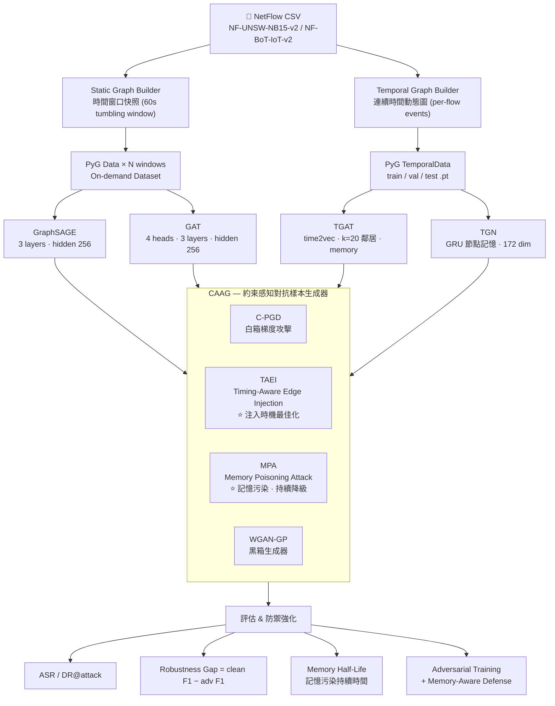

# GNN-TGAT-NIDS

**Timing-Aware Adversarial Attacks on Temporal GNN-based Network Intrusion Detection Systems**

[](https://www.python.org/)
[](https://pytorch.org/)
[](https://pyg.org/)
[](https://docs.astral.sh/uv/)
[](LICENSE)
[]()

> 目標投稿：NDSS 2027 / USENIX Security 2027（備選：IEEE TIFS、RAID 2026）

---

# 👋 Introduction

基於圖神經網路（GNN）的網路入侵偵測系統（NIDS）近年來受到廣泛研究，以 IP/port 為節點、NetFlow 連線為有向邊，藉由鄰域聚合偵測異常行為。然而，當研究者開始引入時序圖神經網路（Temporal GNN，如 TGAT、TGN）以捕捉動態行為模式時，一個關鍵問題浮現：

> [!NOTE]
> 這些為了「更好地理解行為」而設計的記憶機制，是否反而引入了全新的攻擊面？

本研究發現並揭示 3 個尚未被充分研究的弱點：

### 1. 時序記憶機制是可被利用的攻擊面

TGAT 與 TGN 透過 time2vec 時間編碼與 GRU 節點記憶體，在長時間序列中聚合歷史行為特徵。然而，攻擊者可在**關鍵時間窗口**注入精心設計的偽裝流量，污染節點記憶狀態（memory poisoning），造成後續合法攻擊流量被持續誤判為正常——這是靜態 GNN 完全不存在的攻擊向量。

### 2. 時序攻擊的「注入時機」本身是一個未探索的最佳化維度

對靜態 GNN 而言，攻擊時機不影響效果；但對時序 GNN，同一批惡意邊在不同時間點注入，攻擊成功率（ASR）可相差數倍。現有文獻均忽略此維度，導致對時序 NIDS 安全性的評估嚴重失真。

### 3. 現有對抗樣本不切實際

現有 NIDS 對抗攻擊研究普遍在特徵空間中隨意擾動，產生的「對抗流量」違反 TCP 狀態機或使衍生特徵（如 `flow_byts_s`）出現代數矛盾，在真實網路中根本無法重現。這導致已發表的攻擊成功率被系統性高估。

---

## Research Contributions

| 貢獻 | 說明 | 新穎性定位 |
|------|------|--------|
| **Timing-Aware Edge Injection (TAEI)** | 將注入時機 `t*` 形式化為最佳化變數，提出粗-細二段搜尋策略（coarse-then-fine），並以理論分析給出 vulnerable window 的存在性與寬度估計（見下方理論小節） | 時序 GNN 攻擊面的首次形式化；有別於 BAAAN [Han et al., USENIX'21] 的靜態流量擾動 |
| **Memory Poisoning Attack (MPA)** | 利用長期邊注入序列污染 TGN/TGAT 節點記憶體，造成跨時窗的持續性偵測降級；以存活分析框架量化記憶污染的半衰期（memory half-life T½） | 不同於 GNN 後門攻擊 [Xi et al., USENIX'21] 的模型訓練期植入；MPA 在推論期操作，無需模型存取 |
| **約束感知對抗樣本生成器（CAAG）** | 強制執行 TCP 協定合法性、特徵代數一致性、語義保留三類約束；只有通過全部約束（CSR = 1.0）的樣本才納入評估，解決現有文獻高估 ASR 的問題 | 形式化延伸 Pierazzi et al. [S&P'20] 的 problem-space 框架至 NetFlow 時序圖；比 FENCE [Chernikova & Oprea, TOPS'22] 額外覆蓋語義保留與邊注入度數限制 |
| **靜態 vs 時序 GNN 系統性漏洞比較** | 在相同條件下比較 GraphSAGE / GAT / TGAT / TGN（+ GraphMixer 作為現代時序基準），提供首個 timing-aware 攻擊下的系統性評估 | 首個在 CSR=1.0 條件下跨架構的公平對比 |

---

## Positioning Against Prior Work

本研究的核心方法論問題意識源自以下觀察：

| 工作 | 約束執行 | 時序攻擊面 | 記憶機制攻擊 | 限制 |
|------|---------|-----------|------------|------|
| BAAAN [Han et al., USENIX'21] | 部分（traffic-space 功能保留） | ✗ 不考慮注入時機 | ✗ | 僅針對靜態/ML 模型；未量化 CSR |
| FENCE [Chernikova & Oprea, TOPS'22] | 完整（可行性約束） | ✗ | ✗ | 未涵蓋圖結構攻擊；無語義保留 |
| Problem-Space [Pierazzi et al., S&P'20] | 形式化定義（通用框架） | ✗ | ✗ | 通用框架，未針對 GNN 或時序模型實作 |
| GNN Backdoor [Xi et al., USENIX'21] | ✗ | ✗ | 訓練期植入 | 需要污染訓練資料；無法在推論期操作 |
| **本研究（CAAG + TAEI + MPA）** | **CSR = 1.0（完整五類）** | **✓ t* 最佳化** | **✓ 推論期操作** | 需要部分拓撲知識（TAEI）|

---

## ✨ Key Finding (TBD)

> 時序 GNN（TGAT/TGN）在乾淨資料集上的偵測效能優於靜態 GNN，但在 **Timing-Aware Edge Injection** 與 **Memory Poisoning** 攻擊下，其穩健性(robustness)顯著**低於**靜態 GNN。記憶機制的優勢在對抗條件下成為弱點。

---

# 🚀 Getting Started

## Requirements

- Python 3.12 或 3.13
- CUDA 12.4+（僅 CPU 模式可用，但時序模型訓練速度過慢不建議）
- NVIDIA GPU，VRAM ≥ 8 GB（TGN 完整批次訓練建議 ≥ 24 GB）

## Installation

本專案使用 [uv](https://docs.astral.sh/uv/) 作為套件管理器。

1. 安裝 uv：

```bash
curl -LsSf https://astral.sh/uv/install.sh | sh    # Linux / macOS
powershell -ExecutionPolicy ByPass -c "irm https://astral.sh/uv/install.ps1 | iex"  # Windows
```

2. 環境建置與安裝依賴：

```bash
git clone https://github.com/SoWiEee/GNN-TGAT-NIDS.git
cd GNN-TGAT-NIDS

uv sync
uv run pip install pyg_lib torch_scatter torch_sparse torch_cluster \
    -f https://data.pyg.org/whl/torch-2.4.0+cu124.html
```

3. 驗證安裝：

```bash
uv run python -c "import torch; import torch_geometric; \
    print('PyTorch:', torch.__version__); \
    print('PyG:', torch_geometric.__version__); \
    print('CUDA:', torch.cuda.is_available())"
```

## Development Tools

```bash
uv sync --group dev
uv run ruff check src/
uv run pytest
uv run pytest tests/test_constraints.py -v
```

---

## Dataset

- 主要資料集 [NF-UNSW-NB15-v2](https://research.unsw.edu.au/projects/unsw-nb15-dataset) → `data/raw/NF-UNSW-NB15-v2.csv`
- 跨資料集驗證 [NF-BoT-IoT-v2](https://research.unsw.edu.au/projects/bot-iot-dataset) → `data/raw/NF-BoT-IoT-v2.csv`

```bash
# 建立靜態圖（時間窗口快照）
uv run python src/data/static_builder.py --config-name static_default

# 建立時序圖（連續時間動態圖）
uv run python src/data/temporal_builder.py --config-name temporal_default
```

資料集切分採用**嚴格時序順序**（60% Train / 20% Val / 20% Test），不做隨機打散，以避免時序洩漏。

---

## Execution

```bash
# 訓練基準模型
uv run python train.py model=graphsage data=static_default
uv run python train.py model=gat data=static_default
uv run python train.py model=tgat data=temporal_default
uv run python train.py model=tgn data=temporal_default

# 生成對抗樣本（含新攻擊方法）
uv run python attack.py method=cpgd model=graphsage epsilon=0.1 steps=40
uv run python attack.py method=taei model=tgat n_inject=50            # TAEI 白箱（timing 最佳化）
uv run python attack.py method=taei model=tgat n_inject=50 knowledge=blackbox  # TAEI 黑箱（代理模型轉移）
uv run python attack.py method=mpa  model=tgn  horizon=300s           # Memory Poisoning Attack
uv run python attack.py method=gan  target_model=graphsage

# 全比較矩陣評估（所有模型 × 所有攻擊）
uv run python eval/comparison.py --config-name full_matrix

# 對抗訓練
uv run python defense/adversarial_training.py model=tgat attack=taei mix_ratio=1.0
```

所有超參數透過 Hydra 設定檔管理，位於 `configs/{data,model,attack,eval}/`。

---

# 🧱 System Architecture

## Dataflow



---

## 約束感知對抗樣本生成（CAAG）

CAAG 是本框架的核心技術設施。所有攻擊方法在每次更新或生成後，均需通過以下約束集合：

| 約束類型 | 說明 | 實作方式 |
|----------|------|----------|
| 協定合法性 | TCP flag 組合必須對應合法狀態轉移序列 | 規則查找表（14 種合法組合） |
| 特徵代數一致性 | 衍生特徵須重算（如 `flow_byts_s = tot_fwd_byts / flow_duration`） | Inverse transform → 代數重算 → re-transform |
| 特徵邊界 | 每個特徵限制在訓練集 ±3σ 範圍內 | 逐特徵截斷 |
| 語義保留 | 攻擊流量在擾動後仍保留攻擊類別不變量（例如 DDoS 維持高封包率） | Per-class invariant set |
| 度數異常限制 | 邊注入後節點度數須在訓練分佈 3σ 以內 | 統計檢查 |

評估時只使用 **CSR（Constraint Satisfaction Rate）= 1.0** 的樣本，這是與現有文獻的關鍵區別。

---

## Timing-Aware Edge Injection（TAEI）

TAEI 是本研究最核心的新攻擊方法，針對時序 GNN 的時間依賴性：

$$
\text{Objective}: t^* = \arg\min_{t \in [t_{\text{start}},\, t_{\text{attack}}]} F_1\bigl(\texttt{model},\ \texttt{data\_with\_injection\_at}\ t\bigr)
$$

搜尋策略（coarse-then-fine）：

1. 粗粒度：將時間軸切分為 $K$ 個均勻區間，取 ASR 最高的 top-3 區間
2. 細粒度：在每個 top-3 區間內做 binary search，直到區間寬度 $< \tau$（預設 $\tau = 60\text{s}$）

**理論基礎 — Vulnerable Window 的存在性：**

令 $N(\Delta t)$ 為注入時刻到攻擊發生之間目標節點收到的有機流量數量。在 GRU 記憶更新函數具有收縮映射性質的條件下，注入在 $t_{\text{inject}}$ 對 $t_{\text{attack}}$ 分類結果的影響量滿足：

$$
\text{Influence}(\Delta t) \leq C \cdot \rho^{N(\Delta t)}, \quad \rho = \sup_m \|\partial \text{GRU} / \partial m\|_2 < 1
$$

因此存在最優時間差 $\Delta t^*$，其寬度估計為：

$$
\Delta t^* \approx \frac{1}{r_{\text{flow}} \cdot |\ln \rho|}
$$

其中 $r_{\text{flow}}$ 為目標節點的平均流量速率。**節點流量速率越低、模型記憶衰減越慢（$\rho \to 1$），vulnerable window 越寬。** 這一理論預測可在 Timing Sensitivity Curve 實驗中驗證。

**靜態 GNN 與時序 GNN 的攻擊差異：**

| | 靜態 GNN | 時序 GNN |
|--|---------|---------|
| 注入時機影響 | 無（快照獨立） | 顯著（記憶狀態依賴歷史） |
| 最優注入點 $t^*$ | 不存在 | 由 $r_{\text{flow}}$ 與 $\rho$ 決定（可推算） |
| 注入後持續效果 | 僅當前快照 | 可持續影響後續多個時間窗口 |
| 理論預測 vulnerable window | N/A | $\approx 1 / (r_{\text{flow}} \cdot \|\ln\rho\|)$ |

---

## Memory Poisoning Attack（MPA）

MPA 利用 TGN/TGAT 節點記憶體的持久性，透過長期注入序列使模型喪失對特定攻擊類型的偵測能力：

1. 污染期：注入 $N$ 批次偽裝的**良性**邊，使目標節點記憶體偏移
2. 利用期：正常攻擊流量因記憶偏移而被誤判為良性

量化指標：Memory Half-Life = 停止注入後，DR@attack 恢復到原始值 90% 所需的時間步數

---

# 📊 Evaluation Metrics

全部 5 個模型 × 全部 4 種攻擊方法：

| | GraphSAGE | GAT | GraphMixer† | TGAT | TGN |
|---|:---:|:---:|:---:|:---:|:---:|
| C-PGD（白箱梯度） | ✓ | ✓ | ✓ | ✓ | ✓ |
| TAEI 白箱（時機最佳化） | 基準 | 基準 | 基準 | **⭐主要目標** | **⭐主要目標** |
| TAEI 黑箱（代理模型轉移） | ✓ | ✓ | ✓ | ✓ | ✓ |
| MPA（記憶污染） | N/A | N/A | N/A† | **⭐主要目標** | **⭐主要目標** |
| WGAN-GP（黑箱） | ✓ | ✓ | ✓ | ✓ | ✓ |
| 對抗訓練後 | ✓ | ✓ | ✓ | ✓ | ✓ |

> †GraphMixer [Cong et al., ICLR'23] 採用 MLP-Mixer 架構，無 GRU 節點記憶；MPA 理論上不適用，但將作為「無記憶時序模型」的對照組，驗證 MPA 的記憶依賴性假設。

---

# 📝 References

## 靜態圖神經網路

- Hamilton, W., Ying, Z., & Leskovec, J. (2017). **Inductive Representation Learning on Large Graphs.** *NeurIPS 2017.* — GraphSAGE
- Veličković, P., et al. (2018). **Graph Attention Networks.** *ICLR 2018.* — GAT

## 時序圖神經網路

- Xu, D., et al. (2020). **Inductive Representation Learning on Temporal Graphs.** *ICLR 2020.* — TGAT
- Rossi, E., et al. (2020). **Temporal Graph Networks for Deep Learning on Dynamic Graphs.** *arXiv 2020.* — TGN
- Cong, W., et al. (2023). **Do We Really Need Complicated Model Architectures For Temporal Networks?** *ICLR 2023.* — GraphMixer
- Yu, L., et al. (2023). **Towards Better Dynamic Graph Learning: New Architecture and Unified Library.** *NeurIPS 2023.* — DyGLib
- Huang, S., et al. (2023). **Temporal Graph Benchmark for Machine Learning on Temporal Graphs.** *NeurIPS 2023.* — TGB

## 網路入侵偵測

- Mirsky, Y., et al. (2018). **Kitsune: An Ensemble of Autoencoders for Online Network Intrusion Detection.** *NDSS 2018.*
- Lo, W. W., et al. (2022). **E-GraphSAGE: A Graph Neural Network based Intrusion Detection System for IoT.** *IEEE NOMS 2022.*
- Bilot, T., et al. (2023). **Graph Neural Networks for Intrusion Detection: A Survey.** *IEEE Access 2023.*
- Caville, E., et al. (2022). **Anomal-E: A Self-Supervised Network Intrusion Detection System based on Graph Neural Networks.** *Knowledge-Based Systems 2022.*

## 對抗式機器學習基礎

- Goodfellow, I., et al. (2015). **Explaining and Harnessing Adversarial Examples.** *ICLR 2015.* — FGSM
- Madry, A., et al. (2018). **Towards Deep Learning Models Resistant to Adversarial Attacks.** *ICLR 2018.* — PGD
- Arjovsky, M., et al. (2017). **Wasserstein GAN.** *ICML 2017.* — WGAN
- Croce, F., & Hein, M. (2020). **Reliable Evaluation of Adversarial Robustness with an Ensemble of Diverse Parameter-free Attacks.** *ICML 2020.* — AutoAttack

## 圖對抗攻擊與防禦

- Zügner, D., et al. (2018). **Adversarial Attacks on Neural Networks for Graph Data.** *KDD 2018.* — Nettack
- Zügner, D., & Günnemann, S. (2019). **Adversarial Attacks on Graph Neural Networks via Meta Learning.** *ICLR 2019.* — MetaAttack
- Jin, W., et al. (2020). **Graph Structure Learning for Robust Graph Neural Networks.** *KDD 2020.* — Pro-GNN
- Geisler, S., et al. (2021). **Robustness of Graph Neural Networks at Scale.** *NeurIPS 2021.*
- Wan, C., et al. (2023). **Adversarial Attack and Defense on Graph Data: A Survey.** *IEEE TKDE 2023.*

## Problem-Space 約束框架（CAAG 的理論根基）

- Pierazzi, F., et al. (2020). **Intriguing Properties of Adversarial ML Attacks in the Problem Space.** *IEEE S&P 2020.* — problem-space 約束的奠基之作；本研究的 CAAG 在此框架下形式化
- Chernikova, A., & Oprea, A. (2022). **FENCE: Feasibility-based Evasion for Network-based Classifier Evaluation.** *ACM TOPS 2022.* — 針對網路流量分類器的可行性約束規避；CAAG 的直接先驅

## NIDS 對抗式攻擊

- Apruzzese, G., et al. (2021). **Modeling Realistic Adversarial Attacks against Network Intrusion Detection Systems.** *ACM DTRAP 2021.*
- Han, D., et al. (2021). **Practical Traffic-Space Adversarial Attacks on Learning-Based NIDSs.** *USENIX Security 2021.* — BAAAN；本研究最直接的比較基準（需量化 BAAAN 的 CSR 值）
- Yuan, X., et al. (2024). **A Simple Framework to Enhance the Adversarial Robustness of Deep Learning-based Intrusion Detection System.** *Computers & Security 2024.*
- Yang, K., et al. (2024). **Practical Adversarial Attacks Against AI-based Adaptive BitRate Algorithms.** *IEEE S&P 2024.*

## GNN 後門攻擊與持久性攻擊

- Xi, Z., et al. (2021). **Graph Backdoor.** *USENIX Security 2021.* — 訓練期植入觸發子圖；MPA 的推論期操作與此形成對比
- Zhang, Z., et al. (2021). **Backdoor Attacks to Graph Neural Networks.** *SACMAT 2021.* — 圖後門攻擊的系統性分析
- Mujkanovic, S., et al. (2022). **Are Defenses for Graph Neural Networks Robust?** *NeurIPS 2022.* — 現有 GNN 防禦實際上不夠穩健的實證研究

## 動態系統記憶機制攻擊（相關方向）

- Wallace, E., et al. (2021). **Concealed Data Poisoning Attacks on NLP Models.** *NAACL 2021.* — 記憶污染概念；MPA 是其圖推論期的時序版本
- Jia, R., et al. (2019). **Certified Robustness to Adversarial Word Substitutions.** *EMNLP 2019.*

---

## License

MIT License. 詳見 [LICENSE](LICENSE)。
