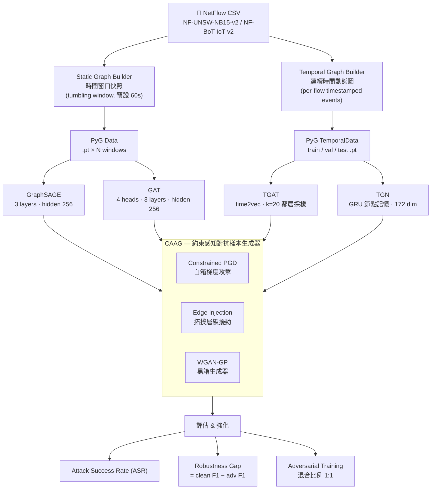

# GNN-TGAT-NIDS

Graph-Aware Adversarial Robustness Framework for Network Intrusion Detection

[](https://www.python.org/)
[](https://pytorch.org/)
[](https://pyg.org/)
[](https://docs.astral.sh/uv/)
[](LICENSE)
[]()

---

# 🔥 Introduction

## Background

基於機器學習的網路入侵偵測系統（ML-NIDS）在乾淨的基準資料集上表現優異，但在對抗性條件下存在兩個尚未被充分研究的弱點：

**問題一：圖結構操控下的對抗規避**

近年來研究者開始以圖神經網路（GNN）建模網路流量，將 IP/埠視為節點、NetFlow 連線視為有向邊，藉助鄰域聚合偵測異常行為。然而攻擊者可透過微調流量特徵、或注入偽裝的合法連線，改變惡意節點的鄰域表示，使 GNN 偵測器將惡意流量誤判為正常。

**問題二：現有對抗樣本不切實際**

現有針對 NIDS 的對抗攻擊研究普遍在特徵空間中隨意擾動，產生的「對抗流量」在真實網路中根本無法重現——它們違反了 TCP 狀態機、或使衍生特徵（如 `flow_byts_s`）出現代數矛盾。這導致已發表的攻擊成功率被系統性高估。

**核心研究問題**

> 時序圖神經網路（TGAT、TGN）是否比靜態 GNN（GraphSAGE、GAT）在對抗攻擊下更具魯棒性？其節點記憶機制是帶來優勢，還是引入新的攻擊面？

---

## Research Contribution

| 貢獻 | 說明 |
|------|------|
| **約束感知對抗樣本生成器（CAAG）** | 在生成過程中強制執行協定合法性、特徵代數一致性、語義保留三類約束，只有通過全部約束（CSR = 1.0）的樣本才納入評估 |
| **靜態 vs 時序 GNN 魯棒性比較** | 首次系統性比較靜態（GraphSAGE、GAT）與時序（TGAT、TGN）圖模型在多種攻擊方法下的魯棒性差異 |
| **邊注入作為圖層級攻擊** | 對靜態與時序模型設計拓撲層級的邊注入策略；時序模型版本中，注入時機本身是最佳化變數 |

---

# 🚀 Getting Started

## Requirements

- Python 3.12 或 3.13
- CUDA 12.4+（僅 CPU 模式可用，但時序模型訓練速度過慢不建議）
- NVIDIA GPU，VRAM ≥ 8 GB（TGN 完整批次訓練建議 ≥ 24 GB）

## Installation

本專案使用 [uv](https://docs.astral.sh/uv/) 作為套件管理器，速度飛快。

1. 安裝 uv：

```bash
curl -LsSf https://astral.sh/uv/install.sh | sh    # Linux
powershell -ExecutionPolicy ByPass -c "irm https://astral.sh/uv/install.ps1 | iex"  # Windows PowerShell
```

2. 環境建置與安裝依賴：

```bash
git clone https://github.com/SoWiEee/GNN-TGAT-NIDS.git
cd GNN-TGAT-NIDS

uv sync
uv run pip install pyg_lib torch_scatter torch_sparse torch_cluster \
    -f https://data.pyg.org/whl/torch-2.4.0+cu124.html
```

3. 執行：

```bash
uv run python -c "import torch; import torch_geometric; \
    print('PyTorch:', torch.__version__); \
    print('PyG:', torch_geometric.__version__); \
    print('CUDA:', torch.cuda.is_available())"
```

## Development Tools

```bash
uv sync --group dev
uv run ruff check src/
uv run pytest
uv run pytest tests/test_constraints.py -v
```

---

## Dataset

- 主要資料集 [NF-UNSW-NB15-v2](https://research.unsw.edu.au/projects/unsw-nb15-dataset) 放置於 `data/raw/NF-UNSW-NB15-v2.csv`
- 跨資料集驗證 [NF-BoT-IoT-v2](https://research.unsw.edu.au/projects/bot-iot-dataset) 放置於 `data/raw/NF-BoT-IoT-v2.csv`

```bash
# 建立靜態圖（時間窗口快照）
uv run python src/data/static_builder.py --config configs/data/static_default.yaml
# 建立時序圖（連續時間動態圖）
uv run python src/data/temporal_builder.py --config configs/data/temporal_default.yaml
```

資料集切分採用**嚴格時序順序**（60% Train / 20% Val / 20% Test），不做隨機打散，以避免時序洩漏。

---

## Execution

```bash
# 訓練靜態基準模型
uv run python train.py model=graphsage data=static
uv run python train.py model=gat data=static

# 訓練時序模型
uv run python train.py model=tgat data=temporal
uv run python train.py model=tgn data=temporal

# 生成對抗樣本
uv run python attack.py method=cpgd model=graphsage epsilon=0.1 steps=40
uv run python attack.py method=edge_injection model=tgat n_inject=50
uv run python attack.py method=gan target_model=graphsage

# 全比較矩陣評估（所有模型 × 所有攻擊）
uv run python eval/comparison.py --config configs/eval/full_matrix.yaml

# 對抗訓練
uv run python defense/adversarial_training.py model=graphsage attack=cpgd mix_ratio=1.0
```

所有超參數透過 Hydra 設定檔管理，位於 `configs/{data,model,attack,eval}/`。

---

# 🧱 System Architecture

## Dataflow



---

## 約束感知對抗樣本生成（CAAG）

CAAG 是本框架的核心技術貢獻。所有攻擊方法在每次梯度更新或樣本生成後，均需通過以下約束集合的投影／驗證：

| 約束類型 | 說明 | 實作方式 |
|----------|------|----------|
| **協定合法性** | TCP flag 組合必須對應合法狀態轉移序列 | 規則查找表 |
| **特徵代數一致性** | 衍生特徵須重新計算（如 `flow_byts_s = tot_fwd_byts / flow_duration`） | 代數重算後投影 |
| **特徵邊界** | 每個特徵限制在訓練集觀察到的 min/max 範圍內 | 逐特徵截斷 |
| **語義保留** | 攻擊流量在擾動後仍保留攻擊類別特徵（例如 DDoS 維持高封包率） | 每類攻擊不變量集合 |
| **度數異常限制** | 邊注入後節點度數須在訓練分佈 3σ 以內 | 統計檢查 |

評估時只使用**約束滿足率（CSR）= 1.0** 的樣本，這是與現有文獻的關鍵區別。

---

# 📊 Evaluation Metrics

每種攻擊方法對每個模型進行評估：

| | GraphSAGE | GAT | TGAT | TGN |
|---|:---:|:---:|:---:|:---:|
| C-PGD（白箱） | ✓ | ✓ | ✓ | ✓ |
| Edge Injection | ✓ | ✓ | ✓ | ✓ |
| WGAN-GP（黑箱） | ✓ | ✓ | ✓ | ✓ |
| 對抗訓練後 | ✓ | ✓ | ✓ | ✓ |

---

# 📝 References

- 基礎圖神經網路
    - Hamilton, W., Ying, Z., & Leskovec, J. (2017). **Inductive Representation Learning on Large Graphs.** *NeurIPS 2017.* — GraphSAGE
    - Veličković, P., et al. (2018). **Graph Attention Networks.** *ICLR 2018.* — GAT
- 時序圖神經網路
    - Xu, D., et al. (2020). **Inductive Representation Learning on Temporal Graphs.** *ICLR 2020.* — TGAT
    - Rossi, E., et al. (2020). **Temporal Graph Networks for Deep Learning on Dynamic Graphs.** *arXiv 2020.* — TGN
    - Cong, W., et al. (2023). **Do We Really Need Complicated Model Architectures For Temporal Networks?** *ICLR 2023.* — GraphMixer（驗證簡單時序架構的基準）
    - Yu, L., et al. (2023). **Towards Better Dynamic Graph Learning: New Architecture and Unified Library.** *NeurIPS 2023.* — DyGLib（統一動態圖學習評估框架）
- 網路入侵偵測
    - Mirsky, Y., et al. (2018). **Kitsune: An Ensemble of Autoencoders for Online Network Intrusion Detection.** *NDSS 2018.*
    - Lo, W. W., et al. (2022). **E-GraphSAGE: A Graph Neural Network based Intrusion Detection System for IoT.** *IEEE NOMS 2022.*
    - Bilot, T., et al. (2023). **Graph Neural Networks for Intrusion Detection: A Survey.** *IEEE Access 2023.*
- 對抗式機器學習基礎
    - Goodfellow, I., et al. (2015). **Explaining and Harnessing Adversarial Examples.** *ICLR 2015.* — FGSM
    - Madry, A., et al. (2018). **Towards Deep Learning Models Resistant to Adversarial Attacks.** *ICLR 2018.* — PGD（本框架 C-PGD 的基礎）
    - Arjovsky, M., et al. (2017). **Wasserstein GAN.** *ICML 2017.* — WGAN（本框架 GAN 生成器的基礎）
- 圖對抗攻擊與防禦
    - Zügner, D., et al. (2018). **Adversarial Attacks on Neural Networks for Graph Data.** *KDD 2018.* — Nettack
    - Zügner, D., & Günnemann, S. (2019). **Adversarial Attacks on Graph Neural Networks via Meta Learning.** *ICLR 2019.* — MetaAttack
    - Jin, W., et al. (2020). **Graph Structure Learning for Robust Graph Neural Networks.** *KDD 2020.* — Pro-GNN
    - Geisler, S., et al. (2021). **Robustness of Graph Neural Networks at Scale.** *NeurIPS 2021.*
- NIDS 對抗式攻擊與防禦
    - Apruzzese, G., et al. (2021). **Modeling Realistic Adversarial Attacks against Network Intrusion Detection Systems.** *ACM DTRAP 2021.*
    - Yuan, X., et al. (2024). **A Simple Framework to Enhance the Adversarial Robustness of Deep Learning-based Intrusion Detection System.** *Computers & Security 2024.*
    - Okada, K., et al. (2024). **XAI-driven Adversarial Attacks on Network Intrusion Detectors.** *EICC 2024.*

---

## License

MIT License. 詳見 [LICENSE](LICENSE)。

```
Copyright (c) 2026 SoWiEee
```
