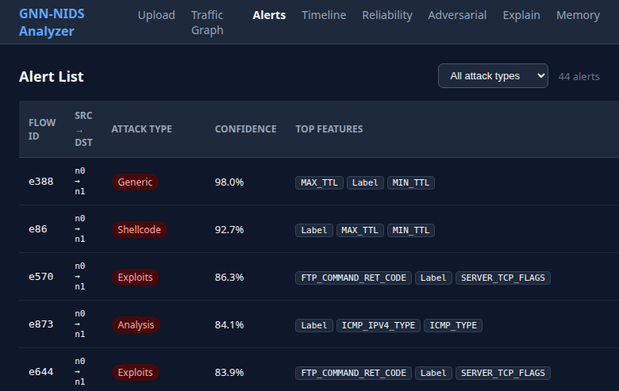
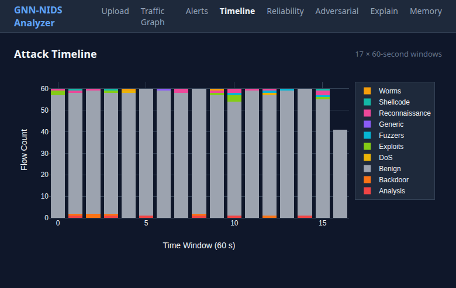
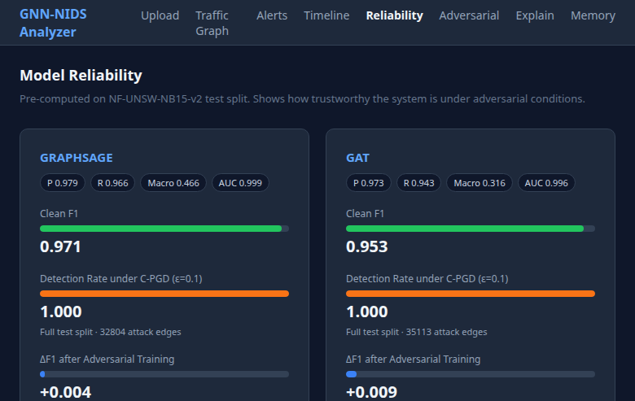
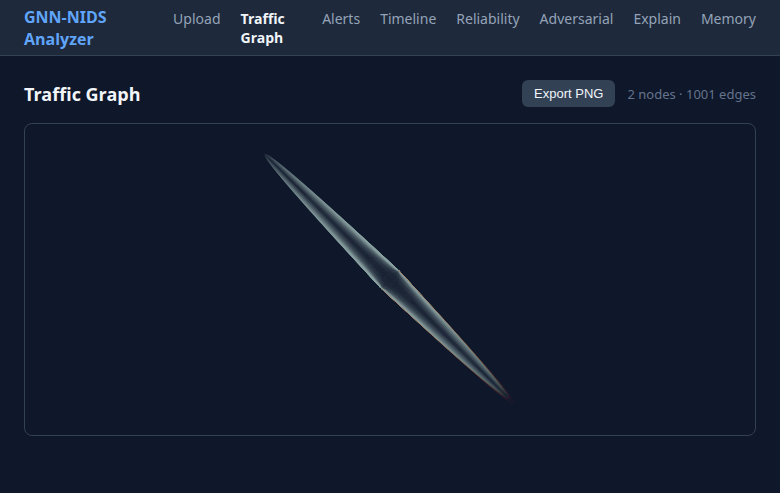
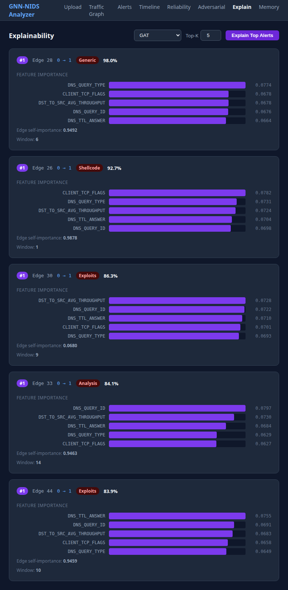
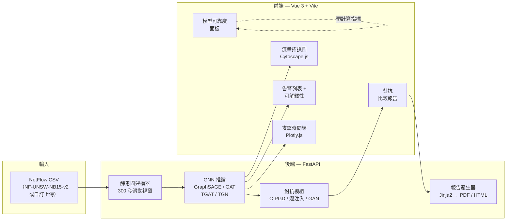

# GNN-TGAT-NIDS

**上傳 NetFlow 流量 → GNN 圖神經網路偵測入侵 → 互動視覺化、告警與安全報告**

[](https://www.python.org/)
[](https://pytorch.org/)
[](https://vuejs.org/)
[](https://fastapi.tiangolo.com/)
[](LICENSE)

> 以圖神經網路驅動的互動式網路入侵偵測系統。
> 上傳 NetFlow CSV，探索流量拓撲圖、檢視告警、取得完整安全報告——包含對抗魯棒性分析。

---

## 快速開始

需要 [Docker](https://docs.docker.com/get-docker/) 與 [NVIDIA Container Toolkit](https://docs.nvidia.com/datacenter/cloud-native/container-toolkit/install-guide.html)。

```bash
git clone https://github.com/SoWiEee/GNN-TGAT-NIDS.git
cd GNN-TGAT-NIDS

# 將已訓練的模型權重放到 checkpoints/（或在容器內訓練）
# 將資料集 CSV 放到 data/raw/（或使用內建 demo）

docker compose up --build
```

| 服務 | 網址 |
|------|------|
| 前端介面 | http://localhost |
| 後端 API | http://localhost:8000 |
| API（透過 nginx） | http://localhost/api/* |

**掛載目錄**（主機 → 容器）：

| 主機路徑 | 容器路徑 | 用途 |
|----------|----------|------|
| `checkpoints/` | `/app/checkpoints` | 模型權重 |
| `data/raw/` | `/app/data/raw` | 上傳資料集 |
| `data/processed/` | `/app/data/processed` | 建構後的圖 |
| `data/metrics/` | `/app/data/metrics` | 模型可靠度面板 |
| `data/sessions/` | `/app/data/sessions` | 分析工作階段 |

**在 Docker 內訓練：**

```bash
docker compose exec backend uv run python train.py model=graphsage
```

> 本機開發、訓練細節、超參數搜索與 ONNX 匯出，請參考 [docs/training.md](docs/training.md)。

---

## 功能特色

| 功能 | 說明 |
|------|------|
| **互動式流量拓撲圖** | IP 節點 + 流量邊，依風險等級上色（Cytoscape.js） |
| **告警列表** | 逐筆流量告警，附攻擊類型、信心值與關鍵特徵 |
| **攻擊時間線** | 攻擊類型堆疊時序分佈圖（Plotly.js） |
| **模型可靠度面板** | 預計算的 Clean F1、對抗偵測率、對抗式訓練 ΔF1 |
| **對抗比較報告** | 原始 vs. 擾動流量的並排比較，含約束驗證，支援 PDF/HTML 匯出 |
| **可解釋性** | GNNExplainer（靜態模型）+ 積分梯度（時序模型），特徵重要度長條圖 |
| **即時串流推論** | 透過 WebSocket 即時分析 NetFlow 流量 |
| **記憶體投毒攻擊** | TGN 專用的記憶體投毒對抗測試 |

### 介面截圖

<table>
  <tr>
    <td align="center" width="50%">
      <br />
      <b>告警列表</b> — 逐筆流量的攻擊分類與信心值
    </td>
    <td align="center" width="50%">
      <br />
      <b>攻擊時間線</b> — 依時間視窗的攻擊類型分佈
    </td>
  </tr>
  <tr>
    <td align="center">
      <br />
      <b>模型可靠度</b> — Clean F1、C-PGD 偵測率、對抗訓練 ΔF1
    </td>
    <td align="center">
      <br />
      <b>流量拓撲圖</b> — IP 節點與流量邊的互動視覺化
    </td>
  </tr>
  <tr>
    <td align="center" colspan="2">
      <br />
      <b>可解釋性</b> — GNNExplainer 特徵重要度分析，顯示每筆攻擊流量的關鍵決策特徵
    </td>
  </tr>
</table>

---

## 系統架構


```mermaid
flowchart LR
    subgraph 輸入
        CSV["NetFlow CSV\n（NF-UNSW-NB15-v2\n或自訂上傳）"]
    end

    subgraph 後端["後端 — FastAPI"]
        SB["靜態圖建構器\n300 秒滑動視窗"]
        GNN["GNN 推論\nGraphSAGE / GAT\nTGAT / TGN"]
        ADV["對抗模組\nC-PGD / 邊注入 / GAN"]
        RPT["報告產生器\nJinja2 → PDF / HTML"]
    end

    subgraph 前端["前端 — Vue 3 + Vite"]
        VIZ["流量拓撲圖\nCytoscape.js"]
        ALT["告警列表 +\n可解釋性"]
        TSC["攻擊時間線\nPlotly.js"]
        MRP["模型可靠度\n面板"]
        ACP["對抗\n比較報告"]
    end

    CSV --> SB --> GNN --> VIZ & ALT & TSC
    GNN --> ADV --> ACP
    ACP --> RPT
    MRP -.->|預計算指標| MRP
```

---

## 模型效能

### 整體表現

靜態模型在 NF-UNSW-NB15-v2 測試集（~397K flows, 3312 windows）上評估；時序模型在 508K 事件上評估。所有模型超參數由 Optuna（TPE sampler + MedianPruner）搜索。

| 指標 | GraphSAGE | GAT | TGAT | TGN | Ensemble |
|------|:---------:|:---:|:----:|:---:|:--------:|
| **Weighted F1** | **0.9773** | 0.9585 | 0.9475 | 0.9463 | 0.9767 |
| **Macro F1** | **0.5735** | 0.4036 | 0.3643 | 0.3438 | 0.5615 |
| Precision | 0.9818 | 0.9686 | 0.9632 | 0.9610 | 0.9819 |
| Recall | 0.9742 | 0.9526 | 0.9391 | 0.9351 | 0.9735 |
| ROC-AUC | 0.9974 | 0.9932 | 0.9963 | 0.9960 | 0.9970 |
| C-PGD DR (ε=0.1) | 1.0000 | 1.0000 | 0.9979 | 0.9965 | — |

> Ensemble 使用 GraphSAGE + GAT 加權軟投票（權重 0.50 / 0.50），在驗證集自動學習。

### 對抗魯棒性

所有模型在 C-PGD 攻擊（ε=0.1, 40 步）下維持 ≥99.6% 的偵測率，顯示 FocalLoss + 約束集的防禦策略有效。

### 對抗式訓練（Adversarial Training）

時序模型使用 C-PGD 對抗式訓練（ε=0.1, 10 步, ratio=0.3）重新訓練後：

| 模型 | Clean F1 | Adv F1 | ΔF1 | 說明 |
|------|:--------:|:------:|:---:|------|
| TGAT | 0.9475 | 0.8938 | -0.0537 | 對抗訓練後 macro_f1=0.1904, ROC-AUC=0.9686 |
| TGN | 0.9463 | 0.9282 | -0.0181 | 對抗訓練後 macro_f1=0.2824, ROC-AUC=0.9941 |

> TGN 的 GRU-based memory 機制在對抗訓練下比 TGAT 的 stateless attention 更穩定（ΔF1 僅 -0.0181 vs -0.0537），且 ROC-AUC 維持 0.9941。

### Optuna 最佳超參數

**GraphSAGE**（50 trials, macro_f1=0.9733 on validation）：

```bash
uv run python train.py model=graphsage \
    train.lr=0.00124 train.focal_gamma=1.0 train.oversample_factor=20 \
    train.class_weight_strategy=sqrt_inverse train.val_metric=macro_f1 \
    train.scheduler=cosine train.patience=30 \
    model.hidden_dim=256 model.num_layers=2 model.dropout=0.0
```

**GAT**（13 trials, macro_f1=0.9674 on validation）：

```bash
uv run python train.py model=gat \
    train.lr=0.00288 train.focal_gamma=1.0 train.oversample_factor=3 \
    train.class_weight_strategy=sqrt_inverse train.val_metric=macro_f1 \
    train.scheduler=cosine train.patience=30 \
    model.hidden_dim=128 model.num_layers=3 model.dropout=0.4 model.num_heads=4
```

**TGAT**（15 trials × 15 epochs, 20% subsample, macro_f1=0.1917 on validation）：

```bash
uv run python train.py model=tgat data=temporal_default \
    train.lr=0.0042 train.focal_gamma=1.0 train.oversample_factor=13 \
    train.class_weight_strategy=effective train.val_metric=macro_f1 \
    train.scheduler=cosine train.patience=15 \
    model.hidden_dim=256 model.heads=4 model.n_neighbors=20
```

**TGN**（15 trials × 15 epochs, 20% subsample, macro_f1=0.1883 on validation）：

```bash
uv run python train.py model=tgn data=temporal_default \
    train.lr=0.0027 train.focal_gamma=1.0 train.oversample_factor=12 \
    train.class_weight_strategy=effective train.val_metric=macro_f1 \
    train.scheduler=cosine train.patience=15 \
    model.hidden_dim=256 model.num_neighbors=30 model.memory_dim=100
```

Optuna 搜索發現：
- 靜態模型偏好 `sqrt_inverse` 類別權重；時序模型偏好 `effective`
- 高 `oversample_factor`（9-20）對稀有類別的召回率至關重要
- 較低的 `focal_gamma`（1.0）優於預設的 2.0，四個模型一致
- GraphSAGE 淺層（2 層）優於深層；GAT 則 3 層表現較好
- 時序模型最佳 `hidden_dim=256`，`n_neighbors=20-30`

### Per-Class F1 分解

**GraphSAGE（最佳 Macro F1）：**

| 類別 | 樣本數 | Precision | Recall | F1 |
|------|-------:|:---------:|:------:|:--:|
| Benign | 369,299 | 0.9998 | 0.9894 | **0.9946** |
| Reconnaissance | 4,330 | 0.8064 | 0.9293 | **0.8635** |
| Fuzzers | 7,502 | 0.7378 | 0.8863 | **0.8053** |
| Exploits | 11,986 | 0.8541 | 0.7319 | **0.7882** |
| Shellcode | 576 | 0.5918 | 0.9236 | **0.7214** |
| Generic | 1,527 | 0.5835 | 0.5102 | **0.5444** |
| Worms | 69 | 0.2353 | 0.6957 | **0.3516** |
| DoS | 1,587 | 0.1993 | 0.4152 | **0.2693** |
| Backdoor | 234 | 0.1266 | 0.5470 | **0.2056** |
| Analysis | 239 | 0.1226 | 0.4310 | **0.1909** |

**GAT（Optuna 調參後重新訓練）：**

| 類別 | 樣本數 | Precision | Recall | F1 |
|------|-------:|:---------:|:------:|:--:|
| Benign | 369,299 | 1.0000 | 0.9787 | **0.9892** |
| Reconnaissance | 4,330 | 0.5213 | 0.8464 | **0.6452** |
| Exploits | 11,986 | 0.7583 | 0.5826 | **0.6589** |
| Fuzzers | 7,502 | 0.4537 | 0.7169 | **0.5557** |
| Shellcode | 576 | 0.4013 | 0.8715 | **0.5495** |
| Worms | 69 | 0.2093 | 0.6522 | **0.3169** |
| DoS | 1,587 | 0.0894 | 0.2376 | **0.1299** |
| Analysis | 239 | 0.0606 | 0.1381 | **0.0842** |
| Generic | 1,527 | 0.2844 | 0.0393 | **0.0690** |
| Backdoor | 234 | 0.0218 | 0.1282 | **0.0372** |

> **分析：** GraphSAGE 在所有攻擊類型上的 F1 均優於 GAT。4 種稀有攻擊類型（DoS, Backdoor, Analysis, Worms）合計不足測試集 0.5%，儘管召回率達 0.43-0.70，精確度因 Benign 類的假陽性而偏低。TGAT/TGN 在 Generic 類（大量 temporal 事件）上表現突出（F1>0.97），但其他攻擊類型受限於序列建模的稀疏性。

---

## 技術架構

| 層級 | 技術 |
|------|------|
| 機器學習 | PyTorch 2.4 + PyTorch Geometric 2.6 |
| 偵測模型 | GraphSAGE, GAT, E-GraphSAGE, TGAT, TGN |
| 對抗攻擊 | C-PGD, 邊注入, GAN, 記憶體投毒 |
| 後端 API | FastAPI + uvicorn |
| 前端 | Vue 3 + Vite + TypeScript + Pinia |
| 視覺化 | Cytoscape.js, Plotly.js |
| 報告產生 | Jinja2 + WeasyPrint |
| 組態管理 | Hydra |
| 部署 | Docker + NVIDIA Container Toolkit |
| CI | GitHub Actions（ruff lint + pytest + 前端 type-check） |

---

## 資料集

- **NF-UNSW-NB15-v2** — 約 250 萬筆流量，9 種攻擊類型 + Benign。放置於 `data/raw/NF-UNSW-NB15-v2.csv`。來源：[UNSW Sydney](https://research.unsw.edu.au/projects/unsw-nb15-dataset)。
- **Demo** — `data/demo/demo_flows.csv`，1000 筆分層抽樣子集（已納入版本控制）。

---

## 文件

| 文件 | 說明 |
|------|------|
| [docs/training.md](docs/training.md) | 訓練指南：優化策略、Optuna 搜索、對抗式訓練、ONNX 匯出 |
| [docs/model_compare.md](docs/model_compare.md) | 模型架構比較與實驗結果 |
| [docs/review.md](docs/review.md) | 專案審查：安全性、API、測試改善 |
| [docs/spec.md](docs/spec.md) | 原始專案規格書 |

---

## 專案結構

```
├── src/                        # ML 核心
│   ├── data/                   # 資料管線（loader, builder, dataset）
│   ├── models/                 # GraphSAGE, GAT, E-GraphSAGE, TGAT, TGN, Ensemble
│   ├── attack/                 # C-PGD, 邊注入, GAN, 記憶體投毒, 時序 C-PGD
│   ├── defense/                # 對抗式訓練
│   ├── explain/                # GNNExplainer + 時序梯度歸因
│   └── utils/
├── app/                        # FastAPI 後端
│   ├── routers/                # analyze, adversarial, report, streaming, explain
│   ├── services/               # inference, graph_builder, report_builder
│   └── templates/
├── frontend/                   # Vue 3 + Vite
│   └── src/views/              # TrafficGraph, AlertList, Timeline, Reliability, Adversarial, Explain
├── scripts/                    # 訓練、評估、匯出工具
├── configs/                    # Hydra 組態（model, data, attack, train）
├── data/
│   ├── demo/                   # Demo 資料集（已納入版本控制）
│   └── metrics/                # 預計算的 reliability.json
├── Dockerfile                  # 後端（PyTorch + CUDA 12.4）
├── frontend/Dockerfile         # 前端（nginx）
├── docker-compose.yml          # GPU 加速的全端部署
└── pyproject.toml
```

---

## 未來工作

- **跨資料集特徵對齊** — 適配不同特徵結構的資料集（如 CIC-IDS-2017, ToN-IoT）
- **靜態模型對抗式訓練** — GraphSAGE/GAT 的 C-PGD 對抗式訓練（框架已就緒，尚未正式訓練）
- **輕量化時序模型** — GraphMixer / SimpleDyG 作為 TGAT/TGN 的快速替代方案
- **E-GraphSAGE 完整評估** — 邊特徵感知模型的完整 Optuna 調參與對抗魯棒性測試

---

## 參考文獻

**GNN 模型**
- Hamilton et al. "Inductive Representation Learning on Large Graphs." *NeurIPS 2017.* — GraphSAGE
- Velickovic et al. "Graph Attention Networks." *ICLR 2018.* — GAT
- Xu et al. "Inductive Representation Learning on Temporal Graphs." *ICLR 2020.* — TGAT
- Rossi et al. "Temporal Graph Networks for Deep Learning on Dynamic Graphs." *arXiv 2020.* — TGN

**GNN 入侵偵測**
- Lo et al. "E-GraphSAGE: A GNN-based IDS for IoT." *IEEE NOMS 2022.*
- Bilot et al. "Graph Neural Networks for Intrusion Detection: A Survey." *IEEE Access 2023.*

**對抗攻擊**
- Han et al. "Practical Traffic-Space Adversarial Attacks on Learning-Based NIDSs." *USENIX Security 2021.*
- Pierazzi et al. "Intriguing Properties of Adversarial ML Attacks in the Problem Space." *IEEE S&P 2020.*
- Madry et al. "Towards Deep Learning Models Resistant to Adversarial Attacks." *ICLR 2018.* — PGD

---

## 授權條款

MIT License。詳見 [LICENSE](LICENSE)。
