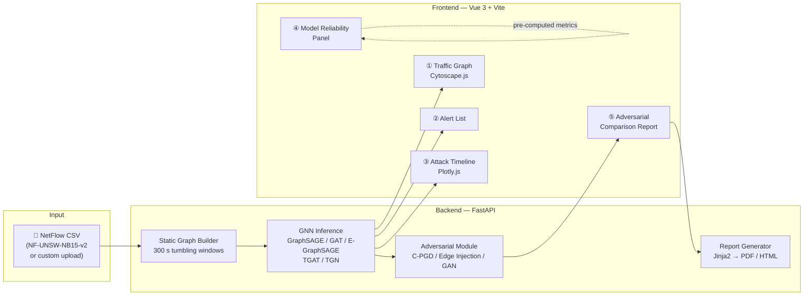

# GNN-TGAT-NIDS

**Upload NetFlow traffic → Detect intrusions with GNN → Visualize, alert, and report**

[](https://www.python.org/)
[](https://pytorch.org/)
[](https://vuejs.org/)
[](https://fastapi.tiangolo.com/)
[](LICENSE)

> An interactive web-based Network Intrusion Detection System powered by Graph Neural Networks.
> Upload a NetFlow CSV, explore the traffic graph, review alerts, and export a full security report — including adversarial robustness analysis.

---

## Features

| # | Feature | Description |
|---|---------|-------------|
| 🔵 | **Interactive Traffic Graph** | IP nodes + flow edges coloured by risk level. Click any node to inspect its connections and threat score. |
| 🔔 | **Alert List** | Per-flow alerts with attack type, confidence score, and the top features that triggered detection (via GAT attention weights). |
| 📊 | **Attack Timeline** | Stacked time-series showing attack-type distribution across 300-second windows. Spot bursts and campaign patterns at a glance. |
| 🛡️ | **Model Reliability Panel** | Pre-computed metrics answering "how trustworthy is this system?": clean F1, detection rate under adversarial attack, and improvement after adversarial training. |
| ⚗️ | **Adversarial Comparison Report** | Side-by-side view of original vs. adversarially-perturbed flows — which features changed, by how much, and whether all network protocol constraints are still satisfied. Exportable as PDF / HTML. |

---

## Architecture


```mermaid
flowchart LR
    subgraph Input
        CSV["📄 NetFlow CSV\n(NF-UNSW-NB15-v2\nor custom upload)"]
    end

    subgraph Backend["Backend — FastAPI"]
        SB["Static Graph Builder\n300 s tumbling windows"]
        GNN["GNN Inference\nGraphSAGE / GAT / E-GraphSAGE\nTGAT / TGN"]
        ADV["Adversarial Module\nC-PGD / Edge Injection / GAN"]
        RPT["Report Generator\nJinja2 → PDF / HTML"]
    end

    subgraph Frontend["Frontend — Vue 3 + Vite"]
        VIZ["① Traffic Graph\nCytoscape.js"]
        ALT["② Alert List"]
        TSC["③ Attack Timeline\nPlotly.js"]
        MRP["④ Model Reliability\nPanel"]
        ACP["⑤ Adversarial\nComparison Report"]
    end

    CSV --> SB --> GNN --> VIZ & ALT & TSC
    GNN --> ADV --> ACP
    ACP --> RPT
    MRP -.->|pre-computed metrics| MRP
```

---

## Quick Start

### Prerequisites

- Python 3.12+, [uv](https://docs.astral.sh/uv/), Node.js 20+
- CUDA 12.4+ (optional; CPU mode is supported for small datasets)

### 1. Backend

```bash
git clone https://github.com/SoWiEee/GNN-TGAT-NIDS.git
cd GNN-TGAT-NIDS

# Install Python dependencies
uv sync
uv run pip install pyg_lib torch_scatter torch_sparse torch_cluster \
    -f https://data.pyg.org/whl/torch-2.4.0+cu124.html

# (Optional) Run tests
uv run pytest
```

### 2. Prepare dataset

```bash
# Merge UNSW-NB15 training + testing CSVs → data/raw/NF-UNSW-NB15-v2.csv
# Also creates data/demo/demo_flows.csv (1 000-flow stratified sample)
uv run python scripts/create_demo_dataset.py

# Build PyG time-window graphs from the merged CSV
uv run python src/data/static_builder.py
```

### 3. Train models (or use pre-trained checkpoints)

```bash
# Static models
uv run python train.py model=graphsage
uv run python train.py model=gat
uv run python train.py model=egraphsage

# Temporal models (requires temporal data built first)
uv run python src/data/temporal_builder.py
uv run python train.py model=tgat data=temporal_default
uv run python train.py model=tgn data=temporal_default

# Early stopping (stop if val_f1 doesn't improve for N epochs)
uv run python train.py model=graphsage train.patience=10
```

### 4. Pre-compute model reliability metrics

```bash
# Runs clean eval + C-PGD attack eval + adversarial-training eval
# Saves results to data/metrics/reliability.json (loaded by the frontend)
uv run python scripts/compute_reliability_metrics.py
```

### 5. Frontend

```bash
cd frontend
npm install
npm run dev          # development server at http://localhost:5173
# or
npm run build && npm run preview    # production preview
```

The FastAPI backend starts automatically when the frontend makes its first request, or run it manually:

```bash
uv run uvicorn app.main:app --reload --port 8000
```

---

## Training Optimization

### Graph node construction — proxy identity from TTL + protocol

UNSW-NB15 processed CSVs contain no IP address columns, which causes a
degenerate 2-node graph per time-window (all flows share the same
`unknown_src → unknown_dst` pair).  GNN message passing over a 2-node graph
adds global window noise to every edge embedding rather than useful neighbourhood
signal.

**Fix:** `static_builder.py` now builds proxy node identities from columns that
are available in the dataset:

| Role | Key | Rationale |
|---|---|---|
| Source node | `("src", sttl // 16, proto)` | TTL bin ≈ OS type (Linux 64→4, Windows 128→8, Cisco 255→15) + protocol |
| Destination node | `("dst", dttl // 16, service)` | TTL + service ≈ server/service segment |

This produces **~20–50 distinct nodes per window** instead of 2, enabling
meaningful neighbourhood aggregation.  Observed effect: val F1 improved from
~0.50 to ~0.84 with the same architecture and only 5 training epochs.

### Time-window size

Default window changed **60 s → 300 s** (`configs/data/static_default.yaml`).
Larger windows give denser graphs (~300 edges/window) at the cost of fewer total
windows (860 vs 4 295).  Denser graphs give the GNN more neighbours per node.

### Automatic Mixed Precision (AMP)

Enabled by default on CUDA via `train.use_amp=true`.  Uses
`torch.amp.autocast` + `GradScaler` — typically **1.5–2× faster** on modern
GPUs with no accuracy loss.  Disable with `train.use_amp=false` if needed.

### DataLoader tuning

| Config key | Default | Effect |
|---|---|---|
| `train.batch_size` | `32` | Graph windows per batch (was 1) |
| `train.num_workers` | `0` | Set to `4` on Linux for async data loading |
| `train.val_every` | `1` | Evaluate on val set every N epochs; `5` saves ~20% time |
| `train.save_every` | `10` | Periodic checkpoint cadence |

### Hyperparameter search with Optuna

```bash
# Install dev extras (includes optuna + optuna-dashboard)
uv sync --group dev

# Search static models
uv run python scripts/tune_hyperparams.py --model graphsage --trials 50
uv run python scripts/tune_hyperparams.py --model gat --trials 50
uv run python scripts/tune_hyperparams.py --model egraphsage --trials 50

# Search temporal models
uv run python scripts/tune_hyperparams.py --model tgat --trials 30
uv run python scripts/tune_hyperparams.py --model tgn --trials 30

# Live dashboard while running (open http://localhost:8080)
uv run optuna-dashboard sqlite:///results/optuna.db
```

The search is **resume-safe** — re-running the same command continues from
where it left off (SQLite storage).  Best parameters are saved to
`results/best_hparams_{model}.json`.

**Search space (static models):**

| Hyperparameter | Range / Choices |
|---|---|
| `lr` | 1 × 10⁻⁴ → 1 × 10⁻² (log scale) |
| `hidden_dim` | 128 / 256 / 512 |
| `num_layers` | 2 / 3 / 4 |
| `dropout` | 0.0 → 0.5 |
| `batch_size` | 16 / 32 / 64 |
| `num_heads` (GAT only) | 2 / 4 / 8 |
| `aggregation` (SAGE only) | mean / max |

**Search space (temporal models):**

| Hyperparameter | Range / Choices |
|---|---|
| `lr` | 1 × 10⁻⁴ → 1 × 10⁻² (log scale) |
| `hidden_dim` | 64 / 128 / 172 / 256 |
| `heads` | 1 / 2 / 4 |
| `n_neighbors` | 10 / 20 / 30 |
| `batch_size` | 100 / 200 / 400 |
| `memory_dim` (TGN only) | 64 / 100 / 128 |

Pruning (MedianPruner) stops unpromising trials after 10 epochs — effectively
free early stopping during search.

**Apply best params to full training:**
```bash
# Example — substitute values from results/best_hparams_graphsage.json
uv run python train.py model=graphsage \
  model.hidden_dim=128 model.num_layers=2 model.dropout=0.1 \
  train.lr=0.0087 train.batch_size=16 train.epochs=200
```

### ONNX export

```bash
# Export static models to ONNX
uv run python scripts/export_onnx.py --model graphsage
uv run python scripts/export_onnx.py --model gat --quantize

# Quantized models use dynamic uint8 quantization (requires onnxruntime)
uv run pip install onnxruntime
uv run python scripts/export_onnx.py --model graphsage --quantize
```

Temporal models (TGAT, TGN) have stateful memory and cannot be exported to a single ONNX graph.

### Adversarial training

Train models with C-PGD augmented batches to improve robustness:

```bash
# Adversarial training (uses separate checkpoint dir)
uv run python train.py model=graphsage train.adversarial_training=true \
    train.epochs=30 train.patience=10 \
    train.checkpoint_dir=checkpoints/graphsage_adv

# Tune adversarial parameters
uv run python train.py model=gat train.adversarial_training=true \
    train.adv_epsilon=0.1 train.adv_steps=10 train.adv_ratio=0.3
```

The adversarially-trained model is saved as `{model}_adv_best.pt` alongside the clean checkpoint. `compute_reliability_metrics.py` automatically picks up `_adv_best.pt` files and computes ΔF1.

### Model ensemble

Combine predictions from multiple static models for improved accuracy:

```python
from src.models.ensemble import EnsembleModel

ensemble = EnsembleModel(
    models={"graphsage": model_gs, "gat": model_gat},
    strategy="soft_vote",  # or "hard_vote", "weighted"
)
proba = ensemble(data)  # averaged softmax probabilities
```

Strategies: `soft_vote` (average probabilities), `hard_vote` (majority vote), `weighted` (custom per-model weights). The API accepts `model=ensemble` in `/api/analyze` to run ensemble inference automatically.

### Streaming inference

Real-time NetFlow analysis via WebSocket:

```
ws://localhost:8000/api/ws/stream?model=graphsage&window_seconds=60
```

**Protocol:**
- Send: `{"flows": [{"col1": val, ...}, ...]}` — buffered into time windows
- Send: `{"command": "flush"}` — force inference on buffered flows
- Receive: `{"type": "alerts", "window": 0, "alerts": [...], "stats": {...}}`
- Receive: `{"type": "ack", "n_buffered": 42, "n_processed": 1000}`

Flows are accumulated into configurable time windows (default 60s). When a window boundary is crossed, the system builds a graph and runs GNN inference, pushing alerts back immediately.

### GNN Explainability

Understand _why_ a flow was classified as an attack using GNNExplainer:

```python
from src.explain.gnn_explainer import explain_flow, explain_top_alerts

# Explain a single edge prediction
result = explain_flow(model, data, edge_idx=42, epochs=200)
# result["top_features"] → [{"name": "node_feat_3", "importance": 0.82}, ...]

# Explain top-5 most confident attack detections
results = explain_top_alerts(model, data, top_k=5)
```

**API endpoints:**
- `POST /api/explain/{session_id}` — explain a specific flow (`edge_idx`, `model`, `epochs`)
- `POST /api/explain-top/{session_id}` — explain top-K alerts automatically

Returns node feature importance scores (src/dst), edge importance masks, and ranked feature contributions. Currently supports static models (GraphSAGE, GAT).

---

## Project Structure

```
GNN-NIDS-Analyzer/
├── src/                        # ML core (reused from GNN-TGAT-NIDS)
│   ├── data/
│   │   ├── loader.py           ← chronological split, label encoding
│   │   ├── static_builder.py   ← NetFlow CSV → PyG Data (tumbling windows)
│   │   └── static_dataset.py   ← on-demand PyG Dataset loader
│   ├── models/
│   │   ├── base.py             ← BaseNIDSModel ABC
│   │   ├── graphsage.py        ← 3-layer GraphSAGE edge classifier
│   │   ├── gat.py              ← 4-head GAT with attention export
│   │   ├── egraphsage.py       ← E-GraphSAGE (edge-feature-aware message passing)
│   │   ├── tgat.py             ← Temporal Graph Attention Network
│   │   ├── tgn.py              ← Temporal Graph Network (GRU memory)
│   │   └── ensemble.py         ← Multi-model ensemble (soft/hard/weighted vote)
│   ├── attack/
│   │   ├── base.py             ← BaseAttack ABC
│   │   ├── constraints.py      ← TCP validity, co-dependency, bounds
│   │   ├── cpgd.py             ← Constrained PGD (feature perturbation)
│   │   ├── edge_injection.py   ← Edge injection attack (structure)
│   │   ├── gan_generator.py    ← WGAN-GP adversarial flow generator
│   │   └── memory_poisoning.py ← TGN memory poisoning attack
│   ├── defense/
│   │   └── adversarial_training.py ← C-PGD augmented training
│   ├── explain/
│   │   └── gnn_explainer.py    ← GNNExplainer for edge-level predictions
│   └── utils/
│       ├── seed.py
│       └── checkpoint.py
├── app/                        # FastAPI application
│   ├── main.py                 ← app entry point, CORS, lifespan
│   ├── routers/
│   │   ├── analysis.py         ← POST /analyze
│   │   ├── adversarial.py      ← POST /adversarial
│   │   ├── report.py           ← GET  /report/{session_id}
│   │   ├── streaming.py        ← WS  /ws/stream (real-time inference)
│   │   └── explain.py          ← POST /explain (GNNExplainer)
│   ├── services/
│   │   ├── inference.py        ← runs GNN on uploaded data
│   │   ├── graph_builder.py    ← builds Cytoscape.js JSON from PyG output
│   │   └── report_builder.py   ← Jinja2 → HTML → WeasyPrint PDF
│   └── templates/
│       └── report.html.j2
├── frontend/                   # Vue 3 + Vite
│   ├── src/
│   │   ├── views/
│   │   │   ├── TrafficGraph.vue
│   │   │   ├── AlertList.vue
│   │   │   ├── AttackTimeline.vue
│   │   │   ├── ReliabilityPanel.vue
│   │   │   └── AdversarialReport.vue
│   │   ├── components/
│   │   ├── stores/             ← Pinia stores
│   │   └── api/                ← axios API client
│   ├── package.json
│   └── vite.config.ts
├── scripts/
│   ├── create_demo_dataset.py      ← merge UNSW-NB15 CSVs, create demo sample
│   ├── compute_reliability_metrics.py ← clean F1 + C-PGD DR → reliability.json
│   ├── multi_seed_eval.py          ← multi-seed training for statistical significance
│   ├── cross_dataset_validation.py ← cross-dataset generalization evaluation
│   ├── window_size_eval.py         ← time-window size sensitivity analysis
│   ├── tune_hyperparams.py         ← Optuna Bayesian hyperparameter search
│   ├── export_onnx.py              ← ONNX export + optional quantization
│   └── pcap_to_netflow.py          ← PCAP → NetFlow CSV (nfstream)
├── configs/                    # Hydra configs
├── data/
│   ├── raw/                    ← place dataset CSVs here (git-ignored)
│   ├── processed/              ← built by static_builder (git-ignored)
│   ├── demo/                   ← curated 1000-flow demo CSV (tracked)
│   └── metrics/
│       └── reliability.json    ← pre-computed F1 / DR / ΔF1
├── checkpoints/                ← pre-trained model weights (git-ignored)
│   ├── graphsage_best.pt
│   ├── gat_best.pt
│   ├── egraphsage_best.pt
│   ├── tgat_best.pt
│   └── tgn_best.pt
├── tests/
├── docs/
│   └── spec.md
├── pyproject.toml
└── README.md
```

---

## Demo

> **Try with the included demo dataset** (1 000 flows, subset of NF-UNSW-NB15-v2):
>
> ```bash
> cp data/demo/demo_flows.csv data/raw/demo_flows.csv
> # then follow Quick Start steps 2 → 5
> ```

### Screenshots

<!-- Add screenshots to docs/screenshots/ and uncomment the rows below -->
| View | Screenshot |
|------|-----------|
| Traffic Graph | `docs/screenshots/traffic-graph.png` |
| Alert List | `docs/screenshots/alert-list.png` |
| Attack Timeline | `docs/screenshots/attack-timeline.png` |
| Model Reliability | `docs/screenshots/reliability-panel.png` |
| Adversarial Report | `docs/screenshots/adversarial-report.png` |

*Capture with `npm run dev` + backend running, then replace paths above with `` syntax.*

---

## Model Reliability (Pre-computed on NF-UNSW-NB15-v2 test split)

| Metric | GraphSAGE | GAT | E-GraphSAGE | TGAT | TGN | Ensemble (3-model) |
|--------|:---------:|:---:|:-----------:|:----:|:---:|:------------------:|
| Weighted F1 (clean) | **0.9712** | **0.9534** | **0.9708** | **0.9475** | **0.9463** | **0.9700** |
| Macro F1 | 0.4657 | 0.3164 | 0.4681 | 0.3643 | 0.3438 | 0.4510 |
| Precision / Recall | 0.9792 / 0.9660 | 0.9729 / 0.9433 | 0.9784 / 0.9665 | 0.9632 / 0.9391 | 0.9610 / 0.9351 | 0.9794 / 0.9650 |
| ROC-AUC | 0.9992 | 0.9963 | 0.9991 | 0.9963 | 0.9960 | 0.9992 |
| DR@attack — C-PGD ε=0.1, 40 steps | 1.0000 | 1.0000 | 1.0000 | 1.0000* | 0.9989* | — |
| ΔF1 after adversarial training | +0.0041 | +0.0087 | — | — | — | — |

*Trained on NF-UNSW-NB15-v2 (~2M flows). Static C-PGD DR is a full 3312-window test sweep. `*` Temporal C-PGD DR is a bounded constrained run with 256 warm-up batches and 32 attacked test batches. Ensemble uses soft-vote over GraphSAGE + GAT + E-GraphSAGE with learned validation-based weights.*

---

## Tech Stack

| Layer | Technology |
|-------|-----------|
| ML framework | PyTorch 2.4 + PyTorch Geometric 2.6 |
| GNN models | GraphSAGE, GAT, E-GraphSAGE, TGAT, TGN |
| Backend | FastAPI + uvicorn |
| Frontend | Vue 3 + Vite + TypeScript |
| Graph visualization | Cytoscape.js |
| Charts | Plotly.js |
| Report generation | Jinja2 + WeasyPrint |
| Config management | Hydra |
| Package manager | uv (Python), npm (JS) |

---

## Datasets

- **NF-UNSW-NB15-v2** (~2.5 M flows, 9 attack types) — primary dataset. Place at `data/raw/NF-UNSW-NB15-v2.csv`. Available from [UNSW Sydney](https://research.unsw.edu.au/projects/unsw-nb15-dataset).
- `data/demo/demo_flows.csv` — 1 000-flow curated subset included in the repository.

---

## Future Work

- **Learning rate scheduler** — Add cosine annealing or ReduceLROnPlateau to reduce late-training val_loss oscillation
- **Cross-dataset feature alignment** — Reuse the source feature schema/scaler or add adapters for datasets whose feature set differs from the current 42-feature checkpoints
- **Full temporal adversarial sweep** — Run constrained temporal C-PGD over the complete temporal test split when sufficient compute is available
- **E-GraphSAGE adversarial training** — Evaluate robustness improvement with adversarial training on E-GraphSAGE
- **Lightweight temporal models** — Evaluate GraphMixer / SimpleDyG as efficient alternatives to TGAT/TGN
- **Frontend enhancements** — Real-time attack timeline updates, model comparison dashboard, user-defined alert rules

---

## References

**GNN Models**
- Hamilton et al. "Inductive Representation Learning on Large Graphs." *NeurIPS 2017.* — GraphSAGE
- Veličković et al. "Graph Attention Networks." *ICLR 2018.* — GAT
- Xu et al. "Inductive Representation Learning on Temporal Graphs." *ICLR 2020.* — TGAT
- Rossi et al. "Temporal Graph Networks for Deep Learning on Dynamic Graphs." *arXiv 2020.* — TGN

**GNN-based NIDS**
- Lo et al. "E-GraphSAGE: A GNN-based IDS for IoT." *IEEE NOMS 2022.*
- Bilot et al. "Graph Neural Networks for Intrusion Detection: A Survey." *IEEE Access 2023.*

**Adversarial Attacks on NIDS**
- Han et al. "Practical Traffic-Space Adversarial Attacks on Learning-Based NIDSs." *USENIX Security 2021.* — BAAAN
- Pierazzi et al. "Intriguing Properties of Adversarial ML Attacks in the Problem Space." *IEEE S&P 2020.*
- Madry et al. "Towards Deep Learning Models Resistant to Adversarial Attacks." *ICLR 2018.* — PGD

---

## License

MIT License. See [LICENSE](LICENSE).
