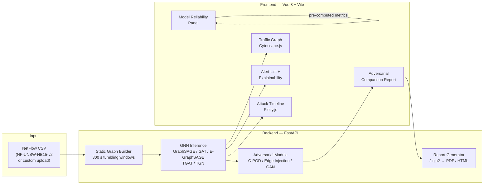

# GNN-TGAT-NIDS

**Upload NetFlow traffic → Detect intrusions with GNN → Visualize, alert, and report**

[](https://www.python.org/)
[](https://pytorch.org/)
[](https://vuejs.org/)
[](https://fastapi.tiangolo.com/)
[](LICENSE)

> An interactive web-based Network Intrusion Detection System powered by Graph Neural Networks.
> Upload a NetFlow CSV, explore the traffic graph, review alerts, and export a full security report — including adversarial robustness analysis.

---

## Quick Start

Requires [Docker](https://docs.docker.com/get-docker/) and the [NVIDIA Container Toolkit](https://docs.nvidia.com/datacenter/cloud-native/container-toolkit/install-guide.html).

```bash
git clone https://github.com/SoWiEee/GNN-TGAT-NIDS.git
cd GNN-TGAT-NIDS

# Place trained checkpoints in checkpoints/ (or train inside the container)
# Place dataset CSV in data/raw/ (or use the included demo)

docker compose up --build
```

| Service | URL |
|---------|-----|
| Frontend | http://localhost |
| Backend API | http://localhost:8000 |
| API via nginx | http://localhost/api/* |

**Volume mounts** (host → container):

| Host path | Container path | Purpose |
|-----------|---------------|---------|
| `checkpoints/` | `/app/checkpoints` | Model weights |
| `data/raw/` | `/app/data/raw` | Upload datasets |
| `data/processed/` | `/app/data/processed` | Built graphs |
| `data/metrics/` | `/app/data/metrics` | Reliability panel |
| `data/sessions/` | `/app/data/sessions` | Analysis sessions |

**Train inside Docker:**

```bash
docker compose exec backend uv run python train.py model=graphsage
```

> For local development without Docker, training details, hyperparameter search, and ONNX export, see [docs/training.md](docs/training.md).

---

## Features

| Feature | Description |
|---------|-------------|
| **Interactive Traffic Graph** | IP nodes + flow edges coloured by risk level (Cytoscape.js) |
| **Alert List** | Per-flow alerts with attack type, confidence, and top features |
| **Attack Timeline** | Stacked time-series of attack-type distribution (Plotly.js) |
| **Model Reliability Panel** | Pre-computed clean F1, adversarial DR, and ΔF1 after adversarial training |
| **Adversarial Comparison** | Side-by-side original vs. perturbed flows with constraint validation. PDF/HTML export |
| **Explainability** | GNNExplainer (static) + integrated gradients (temporal) with feature importance bars |
| **Streaming Inference** | Real-time NetFlow analysis via WebSocket |

---

## Architecture


```mermaid
flowchart LR
    subgraph Input
        CSV["NetFlow CSV\n(NF-UNSW-NB15-v2\nor custom upload)"]
    end

    subgraph Backend["Backend — FastAPI"]
        SB["Static Graph Builder\n300 s tumbling windows"]
        GNN["GNN Inference\nGraphSAGE / GAT / E-GraphSAGE\nTGAT / TGN"]
        ADV["Adversarial Module\nC-PGD / Edge Injection / GAN"]
        RPT["Report Generator\nJinja2 → PDF / HTML"]
    end

    subgraph Frontend["Frontend — Vue 3 + Vite"]
        VIZ["Traffic Graph\nCytoscape.js"]
        ALT["Alert List +\nExplainability"]
        TSC["Attack Timeline\nPlotly.js"]
        MRP["Model Reliability\nPanel"]
        ACP["Adversarial\nComparison Report"]
    end

    CSV --> SB --> GNN --> VIZ & ALT & TSC
    GNN --> ADV --> ACP
    ACP --> RPT
    MRP -.->|pre-computed metrics| MRP
```

---

## Model Performance

Evaluated on NF-UNSW-NB15-v2 test split (~397K flows, 3312 windows).

| Metric | GraphSAGE | GAT | E-GraphSAGE | TGAT | TGN | Ensemble (3) |
|--------|:---------:|:---:|:-----------:|:----:|:---:|:------------:|
| **Weighted F1** | **0.9712** | **0.9534** | **0.9708** | **0.9475** | **0.9463** | **0.9700** |
| Macro F1 | 0.4657 | 0.3164 | 0.4681 | 0.3643 | 0.3438 | 0.4510 |
| Precision / Recall | 0.979 / 0.966 | 0.973 / 0.943 | 0.978 / 0.967 | 0.963 / 0.939 | 0.961 / 0.935 | 0.979 / 0.965 |
| ROC-AUC | 0.9992 | 0.9963 | 0.9991 | 0.9963 | 0.9960 | 0.9992 |
| DR@C-PGD ε=0.1 | 1.0000 | 1.0000 | 1.0000 | 1.0000* | 0.9989* | — |

### Adversarial Training

| Model | Clean F1 | Adv-Trained F1 | ΔF1 |
|-------|:--------:|:--------------:|:---:|
| GraphSAGE | 0.9712 | 0.9753 | **+0.0041** |
| GAT | 0.9534 | 0.9622 | **+0.0087** |
| E-GraphSAGE | 0.9708 | — | not yet trained |
| TGAT / TGN | — | — | not yet trained |

### Macro F1 Improvement

Using `sqrt_inverse` class weights + `focal_gamma=3.0` + `val_metric=macro_f1` + cosine annealing LR:

| Model | Baseline Macro F1 | Improved Macro F1 | Δ | Weighted F1 |
|-------|:-----------------:|:-----------------:|:-:|:-----------:|
| E-GraphSAGE | 0.4681 | **0.5499** | **+0.0818** | 0.9756 |
| GraphSAGE | 0.4657 | **0.5389** | **+0.0732** | 0.9766 |

Largest per-class gains (GraphSAGE): Shellcode **+0.280**, Analysis **+0.129**, Worms **+0.111**.

Both macro F1 and weighted F1 improved — no trade-off. Configure via:

```bash
uv run python train.py model=graphsage \
    train.class_weight_strategy=sqrt_inverse \
    train.focal_gamma=3.0 \
    train.val_metric=macro_f1 \
    train.scheduler=cosine \
    train.patience=20
```

### Per-Class F1 (Ensemble)

| Class | Support | F1 | Note |
|-------|--------:|:--:|------|
| Benign | 369,299 | 0.993 | 93% of test set |
| Exploits | 11,986 | 0.747 | |
| Fuzzers | 7,502 | 0.727 | |
| Reconnaissance | 4,330 | 0.719 | |
| Shellcode | 576 | 0.417 | |
| Generic | 1,527 | 0.307 | confused with DoS/Exploits |
| DoS | 1,587 | 0.206 | confused with Exploits |
| Backdoor | 234 | 0.162 | |
| Analysis | 239 | 0.146 | |
| Worms | 69 | 0.086 | only 69 test samples |

> **Why is Macro F1 low?** NF-UNSW-NB15-v2 has extreme class imbalance — Benign accounts for 93% of the test set, while the 5 rarest attack types (DoS, Generic, Backdoor, Analysis, Worms) together represent <1%. Macro F1 weights all 10 classes equally, so the low F1 on rare classes (~0.08-0.42) drags the average down despite near-perfect Benign detection. The model effectively learns a strong binary classifier (Benign vs. Attack) but cannot reliably distinguish between attack subtypes with <2000 samples. Potential mitigations: per-class oversampling, threshold calibration, or hierarchical classification (binary first, then attack subtype).

`*` Temporal C-PGD DR uses 256 warm-up + 32 attacked batches. Ensemble: soft-vote over GraphSAGE + GAT + E-GraphSAGE with validation-based weights.

---

## Tech Stack

| Layer | Technology |
|-------|-----------|
| ML | PyTorch 2.4 + PyTorch Geometric 2.6 |
| Models | GraphSAGE, GAT, E-GraphSAGE, TGAT, TGN |
| Backend | FastAPI + uvicorn |
| Frontend | Vue 3 + Vite + TypeScript + Pinia |
| Visualization | Cytoscape.js, Plotly.js |
| Reports | Jinja2 + WeasyPrint |
| Config | Hydra |
| Deploy | Docker + NVIDIA Container Toolkit |

---

## Dataset

- **NF-UNSW-NB15-v2** (~2.5M flows, 9 attack types + Benign). Place at `data/raw/NF-UNSW-NB15-v2.csv`. Source: [UNSW Sydney](https://research.unsw.edu.au/projects/unsw-nb15-dataset).
- **Demo**: `data/demo/demo_flows.csv` — 1000-flow curated subset (tracked in git).

---

## Documentation

| Document | Description |
|----------|-------------|
| [docs/training.md](docs/training.md) | Training guide, optimization, Optuna search, adversarial training, ONNX export |
| [docs/model_compare.md](docs/model_compare.md) | Detailed model architecture comparison and experiment results |
| [docs/architecture-review.md](docs/architecture-review.md) | Architecture review, open issues, risk table |
| [docs/spec.md](docs/spec.md) | Original project specification |

---

## Project Structure

```
├── src/                        # ML core
│   ├── data/                   # Data pipeline (loader, builder, dataset)
│   ├── models/                 # GraphSAGE, GAT, E-GraphSAGE, TGAT, TGN, Ensemble
│   ├── attack/                 # C-PGD, Edge Injection, GAN, Memory Poisoning
│   ├── defense/                # Adversarial training
│   ├── explain/                # GNNExplainer + temporal gradient attribution
│   └── utils/
├── app/                        # FastAPI backend
│   ├── routers/                # analyze, adversarial, report, streaming, explain
│   ├── services/               # inference, graph_builder, report_builder
│   └── templates/
├── frontend/                   # Vue 3 + Vite
│   └── src/views/              # TrafficGraph, AlertList, Timeline, Reliability, Adversarial, Explain
├── scripts/                    # Training, evaluation, export utilities
├── configs/                    # Hydra configs (model, data, attack, train)
├── data/
│   ├── demo/                   # Demo dataset (tracked)
│   └── metrics/                # Pre-computed reliability.json
├── Dockerfile                  # Backend (PyTorch + CUDA 12.4)
├── frontend/Dockerfile         # Frontend (nginx)
├── docker-compose.yml          # GPU-enabled full stack
└── pyproject.toml
```

---

## Future Work

- **Cross-dataset feature alignment** — Adapters for datasets with different feature schemas (e.g. CIC-IDS-2017, ToN-IoT)
- **E-GraphSAGE / temporal adversarial training** — Edge-feature-aware and temporal adversarial robustness (framework ready, not yet trained)
- **Lightweight temporal models** — GraphMixer / SimpleDyG as faster alternatives to TGAT/TGN

---

## References

**GNN Models**
- Hamilton et al. "Inductive Representation Learning on Large Graphs." *NeurIPS 2017.* — GraphSAGE
- Velickovic et al. "Graph Attention Networks." *ICLR 2018.* — GAT
- Xu et al. "Inductive Representation Learning on Temporal Graphs." *ICLR 2020.* — TGAT
- Rossi et al. "Temporal Graph Networks for Deep Learning on Dynamic Graphs." *arXiv 2020.* — TGN

**GNN-based NIDS**
- Lo et al. "E-GraphSAGE: A GNN-based IDS for IoT." *IEEE NOMS 2022.*
- Bilot et al. "Graph Neural Networks for Intrusion Detection: A Survey." *IEEE Access 2023.*

**Adversarial Attacks on NIDS**
- Han et al. "Practical Traffic-Space Adversarial Attacks on Learning-Based NIDSs." *USENIX Security 2021.*
- Pierazzi et al. "Intriguing Properties of Adversarial ML Attacks in the Problem Space." *IEEE S&P 2020.*
- Madry et al. "Towards Deep Learning Models Resistant to Adversarial Attacks." *ICLR 2018.* — PGD

---

## License

MIT License. See [LICENSE](LICENSE).
