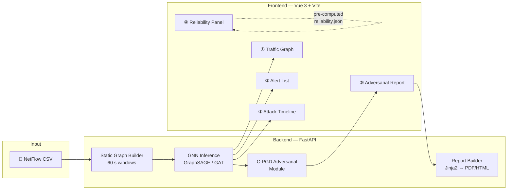

# System Specification: GNN-NIDS Analyzer

> Upload NetFlow traffic → GNN detection → interactive web visualization + adversarial robustness report.

**Version:** 1.0.0
**Status:** Draft
**Last Updated:** 2026-03

---

## Table of Contents

1. [System Overview](#1-system-overview)
   - [1.1 Goal and User Story](#11-goal-and-user-story)
   - [1.2 System Flow](#12-system-flow)
   - [1.3 Out of Scope](#13-out-of-scope)
2. [Architecture](#2-architecture)
   - [2.1 Component Diagram](#21-component-diagram)
   - [2.2 Backend — FastAPI](#22-backend--fastapi)
   - [2.3 Frontend — Vue 3 + Vite](#23-frontend--vue-3--vite)
   - [2.4 Module Structure](#24-module-structure)
   - [2.5 Abstract Base Classes](#25-abstract-base-classes)
   - [2.6 Checkpointing & Reproducibility](#26-checkpointing--reproducibility)
   - [2.7 Coding Standards](#27-coding-standards)
3. [ML Pipeline](#3-ml-pipeline)
   - [3.1 Graph Construction](#31-graph-construction)
   - [3.2 NIDS Models](#32-nids-models)
   - [3.3 Adversarial Module (C-PGD)](#33-adversarial-module-c-pgd)
4. [Data Pipeline](#4-data-pipeline)
5. [Frontend Views](#5-frontend-views)
   - [5.1 Traffic Graph](#51-traffic-graph)
   - [5.2 Alert List](#52-alert-list)
   - [5.3 Attack Timeline](#53-attack-timeline)
   - [5.4 Model Reliability Panel](#54-model-reliability-panel)
   - [5.5 Adversarial Comparison Report](#55-adversarial-comparison-report)
6. [API Design](#6-api-design)
7. [Report Generation](#7-report-generation)
8. [Demo Dataset Strategy](#8-demo-dataset-strategy)
9. [Milestones](#9-milestones)
10. [References](#10-references)

---

## 1. System Overview

### 1.1 Goal and User Story

**Goal:** A self-contained web application that lets a user upload a NetFlow CSV file, runs GNN-based intrusion detection, and presents results as an interactive graph + alert list + report — including adversarial robustness analysis.

**Primary user story:**

> As a network security analyst (or evaluator reviewing this project), I upload a NetFlow CSV.
> Within seconds I see the traffic as an interactive graph coloured by risk, a list of high-confidence alerts with explanation, and a timeline of attack patterns.
> I can select any detected attack flow and see a side-by-side comparison showing how an adversarial perturbation would have evaded the detector — with protocol constraints verified.
> I export a PDF report summarising findings and model reliability metrics.

**Secondary user story (evaluator / reviewer):**

> I want to know how trustworthy this system is.
> The Model Reliability Panel shows me: clean F1, detection rate under adversarial attack, and improvement after adversarial training — answering "what happens if someone tries to fool this?"

### 1.2 System Flow



### 1.3 Out of Scope

- Live PCAP capture / streaming inference (Phase 3 future work)
- TGAT / TGN temporal models in the web app (Phase 3; models exist in `src/` but are not wired to the UI in v1)
- Multi-user authentication / session management
- Production deployment hardening (TLS, rate limiting)

---

## 2. Architecture

### 2.1 Component Diagram

```
┌──────────────────────────────────────────────────────────────┐
│  Browser  (Vue 3 + Vite)                                      │
│  ┌──────────┐ ┌───────────┐ ┌────────────┐ ┌─────────────┐  │
│  │ Traffic  │ │  Alert    │ │  Attack    │ │ Adversarial │  │
│  │ Graph    │ │  List     │ │  Timeline  │ │ Report      │  │
│  │Cytoscape │ │           │ │  Plotly.js │ │ + PDF export│  │
│  └────┬─────┘ └─────┬─────┘ └─────┬──────┘ └──────┬──────┘  │
└───────┼─────────────┼─────────────┼────────────────┼─────────┘
        │  axios      │             │                │
┌───────▼─────────────▼─────────────▼────────────────▼─────────┐
│  FastAPI (uvicorn)                                             │
│  POST /analyze   GET /alerts   GET /timeline   POST /adv      │
│  ┌──────────────────────────────────────────────────────────┐ │
│  │  app/services/                                           │ │
│  │  ├── inference.py   ← loads checkpoint, runs GNN        │ │
│  │  ├── graph_builder.py ← PyG → Cytoscape.js JSON         │ │
│  │  └── report_builder.py ← Jinja2 → WeasyPrint PDF        │ │
│  └──────────────────────────────────────────────────────────┘ │
│  ┌──────────────────────────────────────────────────────────┐ │
│  │  src/  (ML core)                                         │ │
│  │  data/static_builder.py   models/graphsage.py           │ │
│  │  data/static_dataset.py   models/gat.py                 │ │
│  │  attack/constraints.py    attack/cpgd.py                │ │
│  └──────────────────────────────────────────────────────────┘ │
└────────────────────────────────────────────────────────────────┘
```

### 2.2 Backend — FastAPI

**Entry point:** `app/main.py`

```python
from contextlib import asynccontextmanager
from fastapi import FastAPI
from fastapi.middleware.cors import CORSMiddleware
from app.routers import analysis, adversarial, report
from app.services.inference import load_model

@asynccontextmanager
async def lifespan(app: FastAPI):
    load_model()          # load checkpoint once at startup
    yield

app = FastAPI(lifespan=lifespan)
app.add_middleware(CORSMiddleware, allow_origins=["http://localhost:5173"])
app.include_router(analysis.router)
app.include_router(adversarial.router)
app.include_router(report.router)
```

**Session model:** Each uploaded CSV gets a `session_id` (UUID). Processed graphs and inference results are stored under `data/sessions/{session_id}/` and cleaned up after 1 hour.

### 2.3 Frontend — Vue 3 + Vite

**Key dependencies:**

| Package | Purpose |
|---------|---------|
| `vue` 3.x | Composition API |
| `vite` | Build tool + dev server |
| `pinia` | State management (session store, alert store) |
| `vue-router` | Tab-based navigation between 5 views |
| `cytoscape` | Traffic graph rendering |
| `plotly.js` | Attack timeline chart |
| `axios` | API client |

**Store design (Pinia):**

```typescript
// stores/session.ts
interface SessionStore {
  sessionId: string | null
  status: 'idle' | 'uploading' | 'analyzing' | 'ready' | 'error'
  graphData: CytoscapeElements | null
  alerts: Alert[]
  timelineData: PlotlyData | null
  reliability: ReliabilityMetrics | null
}
```

### 2.4 Module Structure

```
src/                           # ML core
├── models/
│   ├── base.py                ← BaseNIDSModel ABC
│   ├── graphsage.py           ← ✅ implemented
│   └── gat.py                 ← ✅ implemented
├── attack/
│   ├── base.py                ← BaseAttack ABC
│   ├── constraints.py         ← ✅ implemented (TCP, bounds, co-dep)
│   └── cpgd.py                ← Phase 2
├── data/
│   ├── loader.py              ← ✅ implemented
│   ├── static_builder.py      ← ✅ implemented
│   └── static_dataset.py      ← ✅ implemented
├── eval/
│   └── metrics.py             ← ✅ implemented
└── utils/
    ├── seed.py                ← ✅ implemented
    └── checkpoint.py          ← ✅ implemented

app/                           # FastAPI application
├── main.py
├── routers/
│   ├── analysis.py
│   ├── adversarial.py
│   └── report.py
├── services/
│   ├── inference.py
│   ├── graph_builder.py
│   └── report_builder.py
└── templates/
    └── report.html.j2

frontend/                      # Vue 3 + Vite
├── src/
│   ├── views/
│   │   ├── TrafficGraph.vue
│   │   ├── AlertList.vue
│   │   ├── AttackTimeline.vue
│   │   ├── ReliabilityPanel.vue
│   │   └── AdversarialReport.vue
│   ├── components/
│   ├── stores/
│   └── api/
├── vite.config.ts
└── package.json

scripts/
└── compute_reliability_metrics.py  ← offline, run once after training
```

> **重要：** `constraints.py` 屬於攻擊邏輯，放在 `src/attack/` 而非 `src/data/`，以避免資料模組對攻擊模組的反向依賴。

### 2.5 Abstract Base Classes

**`src/models/base.py`** — all GNN models implement this interface so `app/services/inference.py` can call any model uniformly:

```python
class BaseNIDSModel(ABC):
    @abstractmethod
    def forward(self, data: Data) -> torch.Tensor:
        """Return per-edge logits (num_edges, num_classes)."""
    @abstractmethod
    def predict_edges(self, data: Data) -> torch.Tensor:
        """Return per-edge predicted class indices."""
    def attention_weights(self, data: Data) -> torch.Tensor | None:
        """Return edge attention weights for alert explanation (GAT only)."""
        return None
```

**`src/attack/base.py`** — adversarial module interface:

```python
class BaseAttack(ABC):
    @abstractmethod
    def generate(self, model: BaseNIDSModel, data, **kwargs): ...
    @abstractmethod
    def constraint_check(self, x_adv, attack_label: int | None = None) -> bool: ...
```

### 2.6 Checkpointing & Reproducibility

- `src/utils/seed.py` — `set_global_seed(seed)` fixes Python / NumPy / PyTorch / CUDA.
- `src/utils/checkpoint.py` — `save_checkpoint` / `load_checkpoint` with epoch tracking.
- `app/services/inference.py` loads the checkpoint **once** at FastAPI startup (lifespan event) and holds the model in memory for the duration of the server process.
- All trained checkpoints are saved to `checkpoints/` (git-ignored); a demo checkpoint is committed separately.

### 2.7 Coding Standards

| Item | Standard |
|------|----------|
| Type hints | Python 3.12 native (`list[int]`, `dict[str, Any]`) |
| Docstrings | Google style (Args / Returns / Raises) |
| Linter | `ruff`, line-length = 100 |
| Backend tests | `pytest tests/` covering `constraints.py`, `metrics.py`, API routes |
| Frontend | TypeScript strict mode; Composition API only; no Options API |

---

## 3. ML Pipeline

### 3.1 Graph Construction Pipeline

#### 3.1.1 Data Ingestion

| Parameter | Value |
|-----------|-------|
| Primary dataset | NF-UNSW-NB15-v2 |
| Secondary dataset | NF-BoT-IoT-v2（跨資料集驗證） |
| Input format | NetFlow CSV (pre-extracted features) |
| Node definition | (IP address, port) tuple |
| Edge definition | Directional flow from src node to dst node |

#### 3.1.2 Static Graph Builder

- **Windowing strategy:** Tumbling windows of configurable duration (default: 60s)
- **Node features:** Aggregated statistics per node per window (degree, total bytes sent/received, unique destination count)
- **Edge features:** Per-flow NetFlow features (34 features from NF-UNSW-NB15-v2)
- **Edge label:** Binary (benign=0, attack=1) and multi-class (attack category)
- **Output format:** PyTorch Geometric `Data` objects, serialized as `.pt` files

**按需載入（`src/data/static_dataset.py`）**

靜態圖建構完成後，不應在訓練時一次性載入所有時間窗口（OOM 風險）。改用 PyG `Dataset` 按需讀取：

```python
from torch_geometric.data import Dataset
import torch

class StaticNIDSDataset(Dataset):
    """On-demand loader for time-window snapshot graphs."""

    def len(self) -> int:
        return len(self.processed_file_names)

    def get(self, idx: int):
        return torch.load(self.processed_paths[idx], weights_only=True)
```

搭配 `DataLoader(num_workers=4)` 做預取，避免 GPU 等待 I/O。

**Scaler 序列化**

`static_builder.py` 完成後，將 `StandardScaler` 序列化供攻擊模組使用（inverse transform → 代數重算 → transform）：

```python
import pickle
from pathlib import Path

scaler_path = Path("data/processed/static/scaler.pkl")
with open(scaler_path, "wb") as f:
    pickle.dump(scaler, f)
```

#### 3.1.3 Feature Normalization

- Z-score normalization fitted **on training split only**
- Clipping at ±3σ to reduce outlier sensitivity
- Categorical features (protocol type) one-hot encoded
- Scaler serialized to `data/processed/{static,temporal}/scaler.pkl` for use by attack modules

---

### 3.2 NIDS Models

所有模型繼承 `src/models/base.py` 的 `BaseNIDSModel`，並統一採用 **weighted cross-entropy** 處理類別不平衡。class weights 由訓練集標籤頻率自動計算。

> ⚠️ NF-UNSW-NB15-v2 的攻擊流量比例遠低於正常流量。若不處理不平衡，所有模型會偏向預測 benign，導致召回率虛高而攻擊偵測率偏低。

#### 3.2.1 Static GNN (Baseline)

**Model A: GraphSAGE**

| Parameter | Default Value |
|-----------|---------------|
| Aggregation | Mean |
| Layers | 3 |
| Hidden dim | 256 |
| Dropout | 0.3 |
| Task | Edge classification |
| Loss | Weighted cross-entropy（class weights from train split） |

**Model B: GAT**

| Parameter | Default Value |
|-----------|---------------|
| Attention heads | 4 |
| Layers | 3 |
| Hidden dim | 256 |
| Dropout | 0.3 |
| Task | Edge classification |
| Loss | Weighted cross-entropy（class weights from train split） |

#### 3.2.2 Temporal GNN (Primary Research Target)

**Model C: TGAT**

| Parameter | Default Value |
|-----------|---------------|
| Attention heads | 2 |
| Time encoding | Learnable time2vec |
| Neighborhood sampling | Most recent k neighbors (k=20) |
| Hidden dim | 172 |
| Task | Edge classification (flow-level) |
| Loss | Weighted cross-entropy（class weights from train split） |
| `memory_reset_policy` | `before_each_attack`（見下） |

**Model D: TGN**

| Parameter | Default Value |
|-----------|---------------|
| Memory dimension | 172 |
| Message function | MLP |
| Memory updater | GRU |
| Embedding module | Graph attention |
| Task | Edge classification |
| Loss | Weighted cross-entropy（class weights from train split） |
| `memory_reset_policy` | `before_each_attack`（見下） |

#### 3.2.3 Temporal Models (Phase 3)

TGAT and TGN are implemented in `src/models/` but are **not connected to the web app in v1**. They are trained and evaluated offline. When wired into the app in Phase 3, the `BaseNIDSModel` interface ensures the rest of the stack requires no changes.

> **Quality gate:** GraphSAGE / GAT must reach weighted F1 ≥ 0.90 on NF-UNSW-NB15-v2 test split before Phase 2 (adversarial module) begins.

---

### 3.3 Adversarial Module (C-PGD)

The adversarial module's sole purpose in v1 is to power **View ⑤ — Adversarial Comparison Report**. It takes a detected attack flow, generates a protocol-valid adversarial version that evades detection, and returns both versions for side-by-side display.

#### 3.3.1 Algorithm

```
Input:  x     — original normalised flow feature vector (attack, detected)
        model — loaded GNN (GraphSAGE or GAT)
        ε     — perturbation budget (default 0.1)
        T     — PGD steps (default 40)
        α     — step size (default 0.01)

Initialize: x_adv ← x + Uniform(-ε, ε)

For t = 1 to T:
    g     ← ∇_x  CrossEntropy(model(x_adv), target=benign)
    x_adv ← x_adv + α · g / (‖g‖₂ + 1e-8)     # normalised gradient step
    x_raw ← scaler.inverse_transform(x_adv)      # back to raw scale
    x_raw ← ConstraintSet.project(x_raw)         # enforce protocol constraints
    x_adv ← scaler.transform(x_raw)             # re-normalise
    x_adv ← clip(x_adv, x − ε, x + ε)

Return: x_adv  if ConstraintSet.check(x_adv) else None   # CSR = 1.0 gate
```

#### 3.3.2 Constraint Set (existing `src/attack/constraints.py`)

All five constraint types are enforced after every PGD step:

| Constraint | Implementation |
|-----------|----------------|
| TCP flag validity | Rule-based lookup (`is_valid_tcp_flags`) |
| Feature co-dependency | Algebraic recompute (`SRC_TO_DST_SECOND_BYTES` etc.) |
| Feature bounds | Per-feature ±3σ clip from training data |
| Semantic preservation | Per-attack-class minimum/maximum invariants |
| Degree anomaly limit | Not applicable to C-PGD (edge injection only) |

#### 3.3.3 Output Format (returned to frontend)

```json
{
  "flow_id": "edge_47",
  "original": {
    "prediction": "DDoS",
    "confidence": 0.942,
    "features": { "IN_PKTS": 60.0, "IN_BYTES": 3000, "FLOW_DURATION_MILLISECONDS": 150, "..." : "..." }
  },
  "adversarial": {
    "prediction": "Benign",
    "confidence": 0.612,
    "features": { "IN_PKTS": 47.3, "IN_BYTES": 2891, "FLOW_DURATION_MILLISECONDS": 150, "..." : "..." },
    "csr": 1.0,
    "changed_features": [
      { "name": "IN_PKTS",  "original": 60.0, "adversarial": 47.3, "delta_pct": -21.2, "constraint_ok": true },
      { "name": "IN_BYTES", "original": 3000,  "adversarial": 2891,  "delta_pct":  -3.6, "constraint_ok": true }
    ]
  }
}
```

---

## 4. Data Pipeline

### 4.1 Directory Structure

```
data/
├── raw/
│   ├── NF-UNSW-NB15-v2.csv
│   └── NF-BoT-IoT-v2.csv
├── processed/
│   ├── static/
│   │   ├── train/          # .pt 檔，每個時間窗口一個
│   │   ├── val/
│   │   ├── test/
│   │   └── scaler.pkl      ← StandardScaler（攻擊模組使用）
│   └── temporal/
│       ├── train.pt
│       ├── val.pt
│       ├── test.pt
│       └── scaler.pkl      ← StandardScaler（攻擊模組使用）
└── adversarial/
    ├── cpgd/
    │   ├── eps0.10_steps40_seed42/     ← 超參數帶入路徑，避免覆蓋
    │   │   ├── graphsage_test.pt
    │   │   ├── gat_test.pt
    │   │   ├── tgat_test.pt
    │   │   └── tgn_test.pt
    │   └── eps0.05_steps20_seed42/
    ├── edge_injection/
    │   └── n50_seed42/
    └── gan/
        └── seed42/
```

### 4.2 Train/Val/Test Split

Strictly chronological — no random shuffling to avoid temporal leakage:

| Split | Proportion | Notes |
|-------|-----------|-------|
| Train | 60% | First 60% of flows by timestamp |
| Val | 20% | Hyperparameter tuning（含攻擊超參數） |
| Test | 20% | Final evaluation only; never used during development |

---

## 5. Frontend Views

All five views are Vue 3 single-file components under `frontend/src/views/`. They share state through Pinia stores and communicate with the backend via the axios API client in `frontend/src/api/`.

### 5.1 View ① — Traffic Graph (`TrafficGraph.vue`)

**Library:** Cytoscape.js

**Data source:** `GET /api/graph/{session_id}`

**Cytoscape.js element schema:**

```typescript
interface CyNode { data: { id: string; ip: string; riskScore: number } }
interface CyEdge {
  data: {
    id: string; source: string; target: string
    prediction: string; confidence: number; flowId: string
  }
}
```

**Visual encoding:**

| Property | Meaning |
|----------|---------|
| Node colour | Max risk score among incident edges: green < 0.5, orange 0.5–0.8, red > 0.8 |
| Node size | Degree (log-scaled) |
| Edge colour | Attack class colour (Benign=grey, DoS=red, DDoS=orange, Recon=yellow, …) |
| Edge width | Confidence score (thicker = higher confidence) |

**Interaction:** Click a node → sidebar shows all incident alerts. Click an edge → open alert detail. "Generate adversarial" button on alert detail triggers View ⑤.

**Performance limit:** Render at most 500 nodes and 2 000 edges; server-side truncation to top-N by confidence score before sending.

---

### 5.2 View ② — Alert List (`AlertList.vue`)

**Data source:** `GET /api/alerts/{session_id}?sort=confidence&page=1&limit=50`

Each alert row displays:

| Column | Source |
|--------|--------|
| Flow ID | edge index |
| Src → Dst | IP:Port strings |
| Attack type | argmax of GNN logits |
| Confidence | softmax probability of predicted class |
| Top-3 features | GAT attention weights (if model = GAT) or top-3 by ±σ deviation |
| Action | "View adversarial" button |

Filtering: by attack type, confidence threshold slider, time window selector.

---

### 5.3 View ③ — Attack Timeline (`AttackTimeline.vue`)

**Library:** Plotly.js stacked bar chart

**Data source:** `GET /api/timeline/{session_id}`

X-axis: time window index (60 s buckets)
Y-axis: flow count per attack class
Stacking: one colour per attack class (matches View ① edge colours)

Click a bar → View ① zooms to that time window's flows.

---

### 5.4 View ④ — Model Reliability Panel (`ReliabilityPanel.vue`)

**Data source:** static file `data/metrics/reliability.json` (served by FastAPI as a static asset; pre-computed once offline)

```json
{
  "graphsage": {
    "clean_f1": 0.921,
    "dr_under_cpgd_eps01": 0.743,
    "delta_f1_after_adv_training": 0.058
  },
  "gat": {
    "clean_f1": 0.934,
    "dr_under_cpgd_eps01": 0.761,
    "delta_f1_after_adv_training": 0.049
  }
}
```

**Display:**

- Three cards per model: "Clean F1", "DR under attack", "After adversarial training"
- Before/After bar chart for ΔF1
- Tooltip: "Detection Rate under C-PGD (ε=0.1, 40 steps) — percentage of adversarial flows still correctly classified"

---

### 5.5 View ⑤ — Adversarial Comparison Report (`AdversarialReport.vue`)

**Trigger:** user clicks "Generate adversarial" on an alert in View ②

**API call:** `POST /api/adversarial` with `{ session_id, flow_id, epsilon, steps }`

**Display — side-by-side comparison table:**

```
┌─────────────────────────────────────────────────────────────────┐
│  Flow edge_47 │ Src: 10.0.0.4:6789  →  Dst: 10.0.0.5:22       │
├──────────────────────┬──────────────────┬──────────────────────┤
│ Feature              │ Original         │ Adversarial          │
├──────────────────────┼──────────────────┼──────────────────────┤
│ IN_PKTS              │ 60.0             │ 47.3  (−21.2%) 🔴    │
│ IN_BYTES             │ 3 000            │ 2 891 ( −3.6%) 🔴    │
│ FLOW_DURATION_MS     │ 150              │ 150   (  0.0%)       │
│ SRC_TO_DST_BYTES/s   │ 20 000           │ 19 273 ← recomputed ✅│
│ TCP_FLAGS            │ SYN (0x02)  ✅   │ SYN (0x02)        ✅ │
├──────────────────────┴──────────────────┴──────────────────────┤
│ Prediction:  DDoS  94.2%  →  Benign  61.2%                     │
│ Constraint Satisfaction Rate:  1.0  ✅                          │
└─────────────────────────────────────────────────────────────────┘
```

Row colours: red = changed feature, grey = unchanged. Green checkmark = constraint passed.

**Export button:** `GET /api/report/{session_id}` → downloads PDF/HTML.

---

## 6. API Design

Base URL: `http://localhost:8000/api`

| Method | Path | Description | Request | Response |
|--------|------|-------------|---------|----------|
| `POST` | `/upload` | Upload CSV, create session | `multipart/form-data` file | `{ session_id, n_flows }` |
| `POST` | `/analyze/{session_id}` | Run GNN inference on uploaded data | `{ model: "graphsage"\|"gat" }` | `{ status }` (async — poll `/status`) |
| `GET` | `/status/{session_id}` | Poll analysis progress | — | `{ status, progress_pct }` |
| `GET` | `/graph/{session_id}` | Cytoscape.js elements (truncated) | `?max_edges=2000` | `{ nodes[], edges[] }` |
| `GET` | `/alerts/{session_id}` | Paginated alert list | `?sort&page&limit&attack_type` | `{ alerts[], total }` |
| `GET` | `/timeline/{session_id}` | Per-window attack counts | — | Plotly-compatible JSON |
| `POST` | `/adversarial` | Run C-PGD on one flow | `{ session_id, flow_id, epsilon, steps }` | adversarial comparison JSON (Section 3.3.3) |
| `GET` | `/report/{session_id}` | Download PDF report | `?format=pdf\|html` | binary file |
| `GET` | `/metrics` | Static model reliability metrics | — | `reliability.json` content |

**Error handling:** all endpoints return `{ detail: string }` with appropriate HTTP status on failure. Analysis errors (e.g. malformed CSV, unsupported columns) return `422`.

---

## 7. Report Generation

**Template:** `app/templates/report.html.j2` (Jinja2)

**Sections in generated report:**

1. **Summary** — session timestamp, uploaded filename, total flows, attack/benign ratio
2. **Top Alerts** — table of top-20 alerts by confidence, with attack type and source/destination
3. **Attack Distribution** — embedded Plotly PNG of the timeline chart
4. **Traffic Graph Snapshot** — static PNG export of Cytoscape.js graph (generated server-side with `cytoscape-png` or Selenium headless)
5. **Model Reliability** — the three metric cards from View ④
6. **Adversarial Sample Analysis** — the comparison table(s) for any flows the user generated adversarial examples for
7. **Methodology Note** — brief description of models used, constraint enforcement, and dataset reference

**PDF generation:** `WeasyPrint` converts the rendered HTML to PDF. The same Jinja2 template renders both HTML download and PDF — the only difference is whether the browser renders it or WeasyPrint does.

---
## 8. Demo Dataset Strategy

The repository includes a curated 1 000-flow demo CSV (`data/demo/demo_flows.csv`) so reviewers and users can try the tool without downloading the full NF-UNSW-NB15-v2 dataset (~2.5 M flows).

**Curation criteria:**

| Criterion | Value |
|-----------|-------|
| Total flows | 1 000 |
| Benign flows | ~400 (40 %) |
| Attack flows | ~600 (60 %, balanced across attack types) |
| Time span | 10 minutes of synthetic-realistic traffic |
| Attack types included | DoS, Reconnaissance, Exploits, Backdoor, Fuzzers |

**How it was built:**

1. Stratified sample from the NF-UNSW-NB15-v2 test split (chronological order preserved).
2. All 34 NF features retained; no feature engineering applied.
3. Verified that `static_builder.py` produces at least 3 non-trivial time windows.
4. Adversarial comparison: 10 high-confidence attack flows pre-selected and their C-PGD adversarial counterparts pre-computed (`data/demo/demo_adversarial.json`).

The demo CSV is tracked by git. The full datasets are not.

---

## 9. Milestones

### Phase 1 — Core Tool (Weeks 1–8)

| Week | Milestone | Deliverable |
|------|-----------|-------------|
| 1–2 | Project scaffold | FastAPI app skeleton, Vue 3 + Vite scaffold, Pinia stores, API client |
| 3 | Data pipeline | `static_builder.py` tested on demo CSV; PyG Data objects generated |
| 4 | GNN training | GraphSAGE + GAT trained on NF-UNSW-NB15-v2; checkpoints saved |
| 5 | Inference service | `POST /analyze` returns graph JSON + alert list |
| 6 | Traffic graph view | Cytoscape.js rendering; click-to-inspect nodes |
| 7 | Alert list + timeline | Alert list with feature importance; Plotly.js stacked bar chart |
| 8 | Model reliability panel | `compute_reliability_metrics.py`; pre-computed `reliability.json` served |

### Phase 2 — Adversarial & Depth (Weeks 9–12)

| Week | Milestone | Deliverable |
|------|-----------|-------------|
| 9 | C-PGD module | `src/attack/cpgd.py`; constraint projection; CSR = 1.0 enforced |
| 10 | Adversarial comparison view | Side-by-side table; delta% per feature; constraint status indicators |
| 11 | Report generation | Jinja2 template; WeasyPrint PDF; HTML download |
| 12 | Demo polish + docs | `data/demo/` curated; README screenshots; public GitHub release |

### Phase 3 — Temporal Models (Future)

- TGAT / TGN models for dynamic graph inference
- PCAP to NetFlow conversion via nfstream
- Memory Poisoning Attack visualization

---

## 10. References

**GNN Models**
- Hamilton, W., et al. "Inductive Representation Learning on Large Graphs." *NeurIPS 2017.* — GraphSAGE
- Veličković, P., et al. "Graph Attention Networks." *ICLR 2018.* — GAT
- Xu, D., et al. "Inductive Representation Learning on Temporal Graphs." *ICLR 2020.* — TGAT
- Rossi, E., et al. "Temporal Graph Networks for Deep Learning on Dynamic Graphs." *arXiv 2020.* — TGN

**GNN-based NIDS**
- Lo, W. W., et al. "E-GraphSAGE: A GNN-based IDS for IoT." *IEEE NOMS 2022.*
- Bilot, T., et al. "Graph Neural Networks for Intrusion Detection: A Survey." *IEEE Access 2023.*

**Adversarial Attacks on NIDS**
- Han, D., et al. "Practical Traffic-Space Adversarial Attacks on Learning-Based NIDSs." *USENIX Security 2021.* — BAAAN
- Pierazzi, F., et al. "Intriguing Properties of Adversarial ML Attacks in the Problem Space." *IEEE S&P 2020.*
- Madry, A., et al. "Towards Deep Learning Models Resistant to Adversarial Attacks." *ICLR 2018.* — PGD
