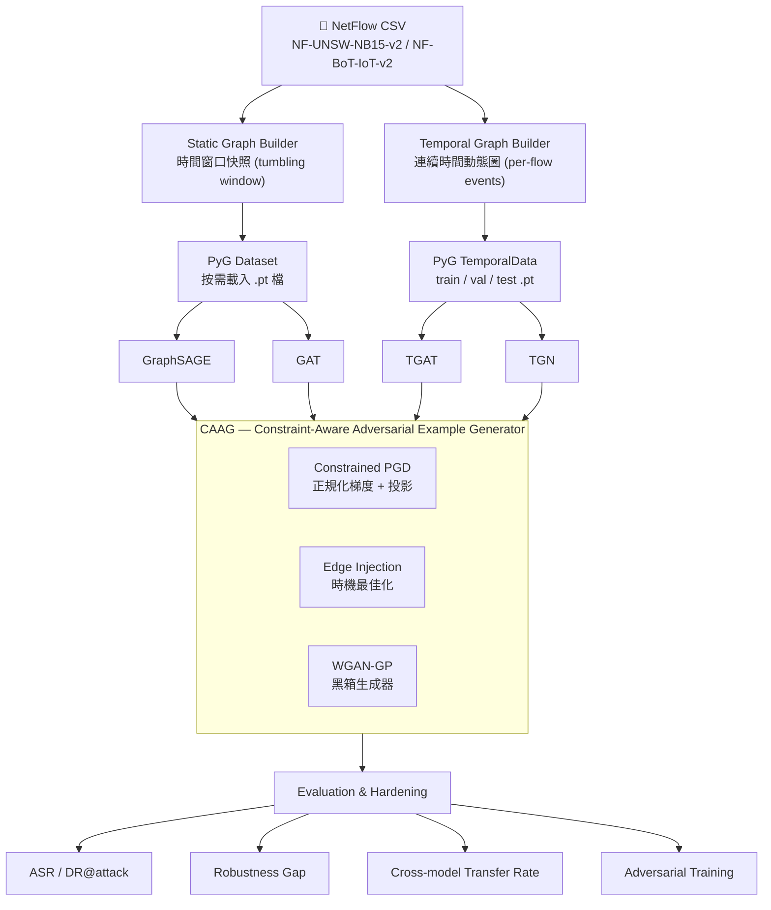
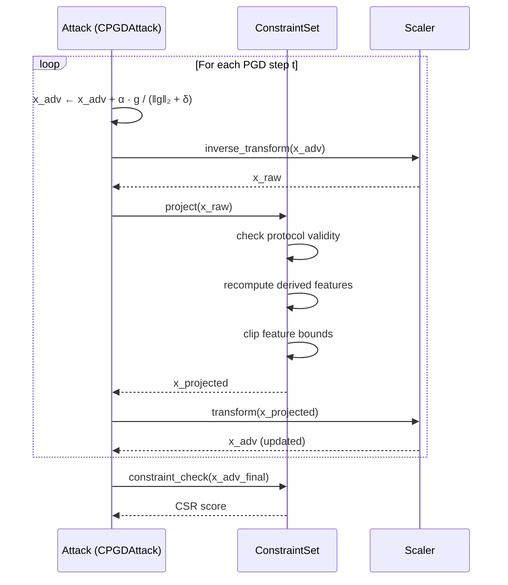

# Design Specification: Graph-Aware Adversarial Robustness Framework for Network Intrusion Detection

> Iterative specification — each section builds on the previous. Implement in the order defined in [Section 7](#7-milestones-and-deliverables).

**Version:** 0.2.0
**Status:** Draft
**Last Updated:** 2026-03

---

## Table of Contents

1. [Overview](#1-overview)
   - [1.1 Problem Statement](#11-problem-statement)
   - [1.2 Research Questions](#12-research-questions)
   - [1.3 Proposed Solution](#13-proposed-solution)
   - [1.4 Overall System Flow](#14-overall-system-flow)
2. [Module Structure](#2-module-structure)
   - [2.1 Codebase Layout](#21-codebase-layout)
   - [2.2 Abstract Base Classes](#22-abstract-base-classes)
   - [2.3 Global Seed & Reproducibility](#23-global-seed--reproducibility)
   - [2.4 Checkpointing](#24-checkpointing)
   - [2.5 Coding Standards](#25-coding-standards)
3. [Component Specifications](#3-component-specifications)
   - [3.1 Graph Construction Pipeline](#31-graph-construction-pipeline)
   - [3.2 NIDS Models](#32-nids-models)
   - [3.3 Constraint-Aware Adversarial Example Generator (CAAG)](#33-constraint-aware-adversarial-example-generator-caag)
   - [3.4 Evaluation Protocol](#34-evaluation-protocol)
4. [Data Pipeline](#4-data-pipeline)
5. [Experimental Configuration](#5-experimental-configuration)
6. [Risks and Mitigations](#6-risks-and-mitigations)
7. [Milestones and Deliverables](#7-milestones-and-deliverables)
8. [Non-Goals](#8-non-goals)
9. [References](#9-references)

---

## 1. Overview

### 1.1 Problem Statement

ML-based Network Intrusion Detection Systems (NIDS) achieve high accuracy on clean benchmark data but remain vulnerable to adversarial evasion attacks. Existing adversarial example generation methods for NIDS suffer from a fundamental limitation: they operate purely in feature space without enforcing network protocol constraints, producing perturbations that are mathematically effective but physically unrealizable in actual network traffic.

Furthermore, the majority of prior work targets static ML models (DNN, RF, SVM). The adversarial robustness of **graph-based** NIDS — which model traffic as relational structures between communicating endpoints — has not been systematically studied. In particular, no prior work has examined whether **temporal graph models** (e.g., TGAT, TGN) offer inherently stronger resistance to adversarial perturbations compared to static graph models (e.g., GraphSAGE, GAT), or whether they introduce new attack surfaces through their node memory mechanisms.

### 1.2 Research Questions

1. Do temporal graph neural networks provide greater adversarial robustness than static GNNs for intrusion detection, given that attackers must simultaneously deceive both spatial and temporal feature dimensions?
2. Can a constraint-aware adversarial example generation framework produce realistic, protocol-valid evasion traffic that transfers across both static and temporal NIDS architectures?
3. Does adversarial training with constraint-enforced examples improve robustness without significant degradation of clean detection performance?

### 1.3 Proposed Solution

A three-component framework:

1. **Unified Graph Construction Pipeline** — converts NetFlow data into both static and continuous-time dynamic graph formats, enabling fair comparison across model architectures.
2. **Dual-Architecture NIDS** — static GNN (GraphSAGE/GAT) as baseline; temporal GNN (TGAT/TGN) as primary research target. All models share a common `BaseNIDSModel` interface.
3. **Constraint-Aware Adversarial Example Generator (CAAG)** — graph-structured attack framework that enforces protocol validity, feature consistency, and semantic preservation constraints during perturbation generation. All attacks share a common `BaseAttack` interface.

### 1.4 Overall System Flow



---

## 2. Module Structure

### 2.1 Codebase Layout

```
src/
├── models/
│   ├── base.py             ← BaseNIDSModel ABC（所有模型共用介面）
│   ├── graphsage.py
│   ├── gat.py
│   ├── tgat.py
│   └── tgn.py
├── attack/
│   ├── base.py             ← BaseAttack ABC（所有攻擊共用介面）
│   ├── constraints.py      ← 約束集合定義與驗證（從 data/ 移至此處）
│   ├── cpgd.py
│   ├── edge_injection.py
│   ├── gan_generator.py
│   └── evaluator.py
├── data/
│   ├── loader.py
│   ├── static_builder.py
│   ├── static_dataset.py   ← PyG Dataset（按需載入）
│   └── temporal_builder.py
├── defense/
│   └── adversarial_training.py
├── eval/
│   ├── metrics.py
│   └── comparison.py       ← 透過 Hydra instantiate 動態載入模型與攻擊
└── utils/
    ├── config.py
    ├── seed.py              ← 全域亂數種子
    ├── checkpoint.py        ← 模型儲存與恢復
    └── logger.py
```

> **重要：** `constraints.py` 屬於攻擊邏輯，放在 `src/attack/` 而非 `src/data/`，以避免資料模組對攻擊模組的反向依賴。

### 2.2 Abstract Base Classes

所有模型與攻擊方法均繼承對應的 ABC，使 `eval/comparison.py` 得以透過統一介面呼叫，新增模型或攻擊方法時不需修改評估邏輯。

**`src/models/base.py`**

```python
from abc import ABC, abstractmethod
import torch
from torch_geometric.data import Data, TemporalData

class BaseNIDSModel(ABC):
    """All NIDS GNN models must implement this interface."""

    @abstractmethod
    def forward(self, data: Data | TemporalData) -> torch.Tensor:
        """Return per-edge logits."""
        ...

    @abstractmethod
    def predict_edges(self, data: Data | TemporalData) -> torch.Tensor:
        """Return per-edge predicted class (argmax of forward)."""
        ...
```

**`src/attack/base.py`**

```python
from abc import ABC, abstractmethod
from src.models.base import BaseNIDSModel

class BaseAttack(ABC):
    """All CAAG attack methods must implement this interface."""

    @abstractmethod
    def generate(self, model: BaseNIDSModel, data, **kwargs):
        """Generate adversarial examples. Returns perturbed data."""
        ...

    @abstractmethod
    def constraint_check(self, x_adv) -> bool:
        """Return True only if all constraints in the constraint set are satisfied."""
        ...
```

`eval/comparison.py` 依賴這兩個介面，配合 Hydra `instantiate` 動態載入（見 [Section 3.4.3](#343-comparison-script)）。

### 2.3 Global Seed & Reproducibility

所有入口腳本（`train.py`、`attack.py`、`eval/comparison.py`）在最開始呼叫 `set_global_seed`，seed 值透過 Hydra 設定注入。

**`src/utils/seed.py`**

```python
import random
import numpy as np
import torch

def set_global_seed(seed: int = 42) -> None:
    """Fix all random sources for full reproducibility."""
    random.seed(seed)
    np.random.seed(seed)
    torch.manual_seed(seed)
    if torch.cuda.is_available():
        torch.cuda.manual_seed_all(seed)
        torch.backends.cudnn.deterministic = True
        torch.backends.cudnn.benchmark = False
```

**`configs/base.yaml`（新增 seed 欄位）**

```yaml
seed: 42
```

### 2.4 Checkpointing

TGN 和 TGAT 在完整資料集上訓練可能需要數小時。所有模型訓練迴圈必須使用 `save_checkpoint` 定期儲存，並支援從中斷點恢復。

**`src/utils/checkpoint.py`**

```python
import torch
from pathlib import Path

def save_checkpoint(model, optimizer, epoch: int, path: str | Path) -> None:
    torch.save({
        "epoch": epoch,
        "model_state": model.state_dict(),
        "optimizer_state": optimizer.state_dict(),
    }, path)

def load_checkpoint(model, optimizer, path: str | Path) -> int:
    """Load checkpoint and return the epoch to resume from."""
    ckpt = torch.load(path, weights_only=True)
    model.load_state_dict(ckpt["model_state"])
    optimizer.load_state_dict(ckpt["optimizer_state"])
    return ckpt["epoch"]
```

Checkpoint 儲存策略：每 `cfg.train.save_every` 個 epoch 儲存一次，另外在驗證集 F1 最高時儲存 `best.ckpt`。

### 2.5 Coding Standards

| 項目 | 規範 |
|------|------|
| 型別提示 | Python 3.12 原生語法（`list[int]`、`dict[str, Any]`），不使用 `from typing import List` |
| Docstring 格式 | Google style（Args / Returns / Raises） |
| Linter | `ruff`，設定於 `pyproject.toml`，line-length = 100 |
| 測試 | `pytest`，放置於 `tests/`，覆蓋 `constraints.py`、`metrics.py` 的所有公開函式 |

---

## 3. Component Specifications

### 3.1 Graph Construction Pipeline

#### 3.1.1 Data Ingestion

| Parameter | Value |
|-----------|-------|
| Primary dataset | NF-UNSW-NB15-v2 |
| Secondary dataset | NF-BoT-IoT-v2（跨資料集驗證） |
| Input format | NetFlow CSV (pre-extracted features) |
| Node definition | (IP address, port) tuple |
| Edge definition | Directional flow from src node to dst node |

#### 3.1.2 Static Graph Builder

- **Windowing strategy:** Tumbling windows of configurable duration (default: 60s)
- **Node features:** Aggregated statistics per node per window (degree, total bytes sent/received, unique destination count)
- **Edge features:** Per-flow NetFlow features (34 features from NF-UNSW-NB15-v2)
- **Edge label:** Binary (benign=0, attack=1) and multi-class (attack category)
- **Output format:** PyTorch Geometric `Data` objects, serialized as `.pt` files

**按需載入（`src/data/static_dataset.py`）**

靜態圖建構完成後，不應在訓練時一次性載入所有時間窗口（OOM 風險）。改用 PyG `Dataset` 按需讀取：

```python
from torch_geometric.data import Dataset
import torch

class StaticNIDSDataset(Dataset):
    """On-demand loader for time-window snapshot graphs."""

    def len(self) -> int:
        return len(self.processed_file_names)

    def get(self, idx: int):
        return torch.load(self.processed_paths[idx], weights_only=True)
```

搭配 `DataLoader(num_workers=4)` 做預取，避免 GPU 等待 I/O。

**Scaler 序列化**

`static_builder.py` 完成後，將 `StandardScaler` 序列化供攻擊模組使用（inverse transform → 代數重算 → transform）：

```python
import pickle
from pathlib import Path

scaler_path = Path("data/processed/static/scaler.pkl")
with open(scaler_path, "wb") as f:
    pickle.dump(scaler, f)
```

#### 3.1.3 Continuous-Time Dynamic Graph Builder

- **Event representation:** Each flow as a timestamped directed edge event
- **Temporal encoding:** Time2Vec encoding for relative time differences
- **Node memory:** Zero-initialized; updated via GRU after each event (TGN-style)
- **Output format:** PyTorch Geometric `TemporalData` objects
- **Chronological split:** Train/val/test split must be strictly chronological (no shuffling)

**Scaler 序列化（同靜態圖）**

```
data/processed/temporal/scaler.pkl
```

**時序切分驗證**

`temporal_builder.py` 完成後強制執行 assertion，防止時序洩漏：

```python
assert train_data.t.max() < val_data.t.min(), \
    f"Temporal leakage: train max={train_data.t.max()}, val min={val_data.t.min()}"
assert val_data.t.max() < test_data.t.min(), \
    f"Temporal leakage: val max={val_data.t.max()}, test min={test_data.t.min()}"
```

#### 3.1.4 Feature Normalization

- Z-score normalization fitted **on training split only**
- Clipping at ±3σ to reduce outlier sensitivity
- Categorical features (protocol type) one-hot encoded
- Scaler serialized to `data/processed/{static,temporal}/scaler.pkl` for use by attack modules

---

### 3.2 NIDS Models

所有模型繼承 `src/models/base.py` 的 `BaseNIDSModel`，並統一採用 **weighted cross-entropy** 處理類別不平衡。class weights 由訓練集標籤頻率自動計算。

> ⚠️ NF-UNSW-NB15-v2 的攻擊流量比例遠低於正常流量。若不處理不平衡，所有模型會偏向預測 benign，導致召回率虛高而攻擊偵測率偏低。

#### 3.2.1 Static GNN (Baseline)

**Model A: GraphSAGE**

| Parameter | Default Value |
|-----------|---------------|
| Aggregation | Mean |
| Layers | 3 |
| Hidden dim | 256 |
| Dropout | 0.3 |
| Task | Edge classification |
| Loss | Weighted cross-entropy（class weights from train split） |

**Model B: GAT**

| Parameter | Default Value |
|-----------|---------------|
| Attention heads | 4 |
| Layers | 3 |
| Hidden dim | 256 |
| Dropout | 0.3 |
| Task | Edge classification |
| Loss | Weighted cross-entropy（class weights from train split） |

#### 3.2.2 Temporal GNN (Primary Research Target)

**Model C: TGAT**

| Parameter | Default Value |
|-----------|---------------|
| Attention heads | 2 |
| Time encoding | Learnable time2vec |
| Neighborhood sampling | Most recent k neighbors (k=20) |
| Hidden dim | 172 |
| Task | Edge classification (flow-level) |
| Loss | Weighted cross-entropy（class weights from train split） |
| `memory_reset_policy` | `before_each_attack`（見下） |

**Model D: TGN**

| Parameter | Default Value |
|-----------|---------------|
| Memory dimension | 172 |
| Message function | MLP |
| Memory updater | GRU |
| Embedding module | Graph attention |
| Task | Edge classification |
| Loss | Weighted cross-entropy（class weights from train split） |
| `memory_reset_policy` | `before_each_attack`（見下） |

#### 3.2.3 TGN / TGAT Memory Reset Policy

TGN 的節點記憶體在訓練後會保留狀態。攻擊評估時若不定義重置時機，不同攻擊的起始狀態不同，ASR 不具可比性。

| Policy | 說明 | 使用時機 |
|--------|------|----------|
| `before_each_attack` | 每次執行一個攻擊方法前，將所有節點記憶體重置為零 | **預設**；保證每個攻擊從相同起始狀態開始 |
| `never` | 保留跨攻擊的累積記憶體 | 研究記憶體污染（memory poisoning）的場景 |
| `per_epoch` | 每個訓練 epoch 開始時重置 | 對抗訓練迴圈 |

在 `configs/attack/` 中以 `memory_reset_policy` 欄位指定：

```yaml
# configs/attack/cpgd.yaml
memory_reset_policy: before_each_attack
target_split: test
```

> **Checkpoint:** 靜態 GNN baseline 必須在 NF-UNSW-NB15-v2 上重現 weighted F1 ≥ 0.90，才進入時序模型開發。

---

### 3.3 Constraint-Aware Adversarial Example Generator (CAAG)

CAAG 是本框架的核心技術貢獻，位於 `src/attack/`。所有攻擊方法繼承 `BaseAttack`，並在生成後呼叫 `constraint_check()`。

#### 3.3.1 Threat Model

| Scenario | Description |
|----------|-------------|
| White-box | Attacker has full access to model weights and architecture |
| Black-box (transfer) | Attacker trains surrogate model; transfers adversarial examples |
| Gray-box | Attacker knows feature space but not model internals |

#### 3.3.2 Attack Methods

---

**Attack 1: Constrained PGD (C-PGD)**

White-box gradient-based attack. 使用正規化梯度（normalized gradient）更新，而非 FGSM 的 `sign(∇L)`，以保留連續特徵空間的梯度大小資訊，達到精確的 L2 最佳化。

```
Initialize: x_adv ← x + Uniform(-ε, ε)     # 隨機起始點
For t = 1 to T:
    g ← ∇_x L(f(G, x_adv), y_target)
    x_adv ← x_adv + α · g / (‖g‖₂ + δ)     # normalized gradient（δ = 1e-8）
    x_adv ← Project(x_adv, C)               # 約束投影（見 Section 3.3.3）
    x_adv ← clip(x_adv, x - ε, x + ε)      # L∞ ball（若有指定 epsilon）
```

> ⚠️ 約束投影 `Project()` 需先將 `x_adv` 做 **inverse transform**（還原為原始尺度），執行代數重算後，再重新 **transform**（正規化）。因此必須在執行攻擊前載入 `data/processed/*/scaler.pkl`。

**設定欄位：**

```yaml
# configs/attack/cpgd.yaml
_target_: src.attack.cpgd.CPGDAttack
epsilon: 0.1
steps: 40
step_size: 0.01
norm: l2              # l2 (normalized gradient) 或 linf (sign gradient)
memory_reset_policy: before_each_attack
target_split: test    # val: 調整超參數; test: 最終報告
```

---

**Attack 2: Edge Injection**

Injects synthetic benign-looking edges to corrupt GNN neighborhood aggregation. For temporal models, **injection timing** is an optimization variable.

**Injection Constraints:**
- Injected edges must originate from existing legitimate IP ranges
- Flow features must be statistically normal (within 3σ of benign distribution)
- Node degree after injection must not exceed 3σ of training distribution

**Timing Optimization for Temporal Models:**

```
objective: t* = argmin_{t ∈ [t_start, t_attack]} F1(model, data_with_injection_at=t)

Search strategy:
  Step 1 (Coarse): divide [t_start, t_attack] into K equal intervals
                   evaluate ASR at each interval midpoint → pick top-3
  Step 2 (Fine):   binary search within each top-3 interval
                   convergence when interval width < τ (default τ = 60s)
```

**設定欄位：**

```yaml
# configs/attack/edge_injection.yaml
_target_: src.attack.edge_injection.EdgeInjectionAttack
n_inject: 50
timing_search: coarse_then_fine    # only for temporal models; "none" for static
coarse_intervals: 10
tau_seconds: 60
memory_reset_policy: before_each_attack
target_split: test
```

---

**Attack 3: GAN-based Generator (Black-box)**

Conditional WGAN-GP trained to generate feature vectors that (a) fool the NIDS classifier and (b) satisfy the constraint set.

**Training Stability Criteria:**

GAN 訓練期間，若以下任一條件觸發，視為不穩定並提前停止，退回純 C-PGD 評估：

| Indicator | 不穩定門檻 |
|-----------|-----------|
| Critic loss 振盪 | 連續 500 iter 內 loss 範圍 > 10 |
| Constraint Satisfaction Rate | 生成樣本 CSR < 0.3（持續 1000 iter） |
| Mode collapse | 生成樣本特徵 pairwise cosine similarity > 0.95 |

```yaml
# configs/attack/gan.yaml
_target_: src.attack.gan_generator.GANAttack
latent_dim: 128
gp_weight: 10
critic_iters: 5
max_iter: 50000
early_stop_patience: 1000
memory_reset_policy: before_each_attack
target_split: test
```

#### 3.3.3 Constraint Set Definition

約束定義於 `src/attack/constraints.py`。所有攻擊方法在每次梯度更新後呼叫 `ConstraintSet.project(x_adv, scaler)`。

| Constraint Type | Description | Implementation |
|----------------|-------------|----------------|
| **Protocol validity** | TCP flag combinations must be valid state sequences | Rule-based lookup table |
| **Feature co-dependency** | `flow_byts_s = tot_fwd_byts / flow_duration`；衍生特徵須在 inverse transform 後重新計算 | Algebraic recomputation → re-transform |
| **Feature bounds** | Each feature clipped to empirically observed min/max from training data | Per-feature bound table |
| **Semantic preservation** | Attack traffic must retain attack-class characteristics (e.g., DDoS must maintain high packet rate) | Per-attack-type invariant set |
| **Degree anomaly limit** | Node degree after edge injection must remain within 3σ of training distribution | Statistical check |

#### 3.3.4 Constraint Satisfaction Rate (CSR)

```
CSR = |{x_adv : all constraints satisfied}| / |{x_adv generated}|
```

Only adversarial examples with **CSR = 1.0** are used in robustness evaluation. This is the key differentiator from prior work that reports attack success without constraint validation.

**Constraint Check Sequence Diagram**



---

### 3.4 Evaluation Protocol

#### 3.4.1 Split Usage Policy

對抗樣本的集合歸屬需明確定義，以避免測試集洩漏。

| 用途 | 使用集合 | 理由 |
|------|---------|------|
| 攻擊超參數調整（ε、steps） | **Validation set** | 避免在測試集上過擬合攻擊參數 |
| 最終 ASR / Robustness Gap 報告 | **Test set** | 與乾淨 F1 使用相同集合 |
| 對抗訓練的對抗樣本 | **Training set** | 不得使用測試集資料訓練模型 |

在每個攻擊設定的 `target_split` 欄位中明確指定。

#### 3.4.2 Clean Performance Metrics

- Weighted F1, Precision, Recall (per-class and macro)
- ROC-AUC
- Inference latency (ms/batch) and peak GPU memory usage

#### 3.4.3 Adversarial Robustness Metrics

| Metric | Definition |
|--------|------------|
| **Attack Success Rate (ASR)** | Fraction of adversarial examples (with CSR=1.0) that cause misclassification |
| **DR@attack** | Detection Rate of the NIDS under adversarial conditions |
| **Robustness Gap** | Clean F1 − Adversarial F1 |
| **Transfer Rate** | ASR when adversarial examples from Model A are evaluated on Model B（見下） |

**Transfer Rate 定義細節**

| 問題 | 規範 |
|------|------|
| 在哪個集合生成？ | Test set of the **source model** |
| 在哪個集合評估？ | 相同的 test set（兩個模型使用相同資料切分） |
| 靜態 → 時序跨格式？ | 攻擊特徵向量可直接轉移；圖拓撲若不相容則僅評估特徵層攻擊 |

#### 3.4.4 Comparison Matrix

Every attack method × every model:

| | GraphSAGE | GAT | TGAT | TGN |
|---|:---:|:---:|:---:|:---:|
| C-PGD（white-box） | ✓ | ✓ | ✓ | ✓ |
| Edge Injection | ✓ | ✓ | ✓ | ✓ |
| GAN（black-box） | ✓ | ✓ | ✓ | ✓ |
| After Adv. Training | ✓ | ✓ | ✓ | ✓ |

#### 3.4.5 Comparison Script: Hydra `instantiate`

`eval/comparison.py` 透過 Hydra 動態載入模型與攻擊，不直接 import 任何具體類別。新增模型或攻擊只需新增對應 YAML，不需修改評估腳本。

```python
# eval/comparison.py
from hydra.utils import instantiate
import hydra
from omegaconf import DictConfig

@hydra.main(config_path="../configs", config_name="eval/full_matrix")
def main(cfg: DictConfig) -> None:
    from src.utils.seed import set_global_seed
    set_global_seed(cfg.seed)

    model  = instantiate(cfg.model)   # 由 configs/model/*.yaml 決定
    attack = instantiate(cfg.attack)  # 由 configs/attack/*.yaml 決定

    adv_data = attack.generate(model, test_data)
    metrics  = evaluator.compute(model, adv_data)
    ...
```

#### 3.4.6 Adversarial Training

- Generate adversarial examples using C-PGD on **training set**
- Mix with clean examples at ratio 1:1
- Retrain model for same number of epochs
- Evaluate on both clean and adversarial **test sets**
- Report robustness-accuracy trade-off curve
- TGN/TGAT: use `memory_reset_policy: per_epoch` during adversarial training

---

## 4. Data Pipeline

### 4.1 Directory Structure

```
data/
├── raw/
│   ├── NF-UNSW-NB15-v2.csv
│   └── NF-BoT-IoT-v2.csv
├── processed/
│   ├── static/
│   │   ├── train/          # .pt 檔，每個時間窗口一個
│   │   ├── val/
│   │   ├── test/
│   │   └── scaler.pkl      ← StandardScaler（攻擊模組使用）
│   └── temporal/
│       ├── train.pt
│       ├── val.pt
│       ├── test.pt
│       └── scaler.pkl      ← StandardScaler（攻擊模組使用）
└── adversarial/
    ├── cpgd/
    │   ├── eps0.10_steps40_seed42/     ← 超參數帶入路徑，避免覆蓋
    │   │   ├── graphsage_test.pt
    │   │   ├── gat_test.pt
    │   │   ├── tgat_test.pt
    │   │   └── tgn_test.pt
    │   └── eps0.05_steps20_seed42/
    ├── edge_injection/
    │   └── n50_seed42/
    └── gan/
        └── seed42/
```

### 4.2 Train/Val/Test Split

Strictly chronological — no random shuffling to avoid temporal leakage:

| Split | Proportion | Notes |
|-------|-----------|-------|
| Train | 60% | First 60% of flows by timestamp |
| Val | 20% | Hyperparameter tuning（含攻擊超參數） |
| Test | 20% | Final evaluation only; never used during development |

---

## 5. Experimental Configuration

All experiments managed via Hydra config files under `configs/`.

### 5.1 Key Hyperparameters

| Parameter | Default | Search Range |
|-----------|---------|-------------|
| **seed** | **42** | fixed（reproducibility） |
| Time window size | 60s | {30, 60, 120} |
| GNN hidden dim | 256 | {128, 256, 512} |
| PGD steps | 40 | {10, 20, 40} |
| PGD step size α | 0.01 | {0.001, 0.01, 0.1} |
| Perturbation budget ε | 0.1 | {0.05, 0.1, 0.2} |
| Adv. training mix ratio | 1:1 | {1:3, 1:1, 3:1} |
| `save_every` (epochs) | 5 | fixed |

### 5.2 Hardware Requirements

| Component | Minimum | Recommended |
|-----------|---------|-------------|
| GPU | NVIDIA GTX 1080 (8GB VRAM) | NVIDIA RTX 3090 (24GB VRAM) |
| RAM | 16 GB | 32 GB |
| Storage | 20 GB | 50 GB |
| CUDA | 12.4 | 12.4+ |

---

## 6. Risks and Mitigations

| Risk | Probability | Impact | Mitigation |
|------|-------------|--------|------------|
| Temporal graph pipeline takes >2 months | Medium | High | Use PyG built-in `TemporalData`; avoid custom PCAP processing |
| TGAT experiments incomplete by month 9 | Medium | Medium | Month 6 hard checkpoint; TGAT is additive, not core |
| Constraint satisfaction rate too low | Low | High | Iteratively relax constraints with documented justification per constraint type |
| GAN training instability | Medium | Low | Early-stop when any of the 3 instability criteria triggers; fall back to C-PGD only |
| NF-UNSW-NB15-v2 label noise | Low | Medium | Manual inspection of ambiguous samples; document exclusions |
| OOM on large static graph loading | Medium | Medium | Use PyG `Dataset` on-demand loading（see Section 3.1.2） |
| TGN memory state inconsistency across attacks | Medium | High | Enforce `memory_reset_policy: before_each_attack` as default |

---

## 7. Milestones and Deliverables

| Month | Milestone | Deliverable |
|-------|-----------|-------------|
| 1–2 | 基礎設施完成 | `BaseNIDSModel`、`BaseAttack`、`seed.py`、`checkpoint.py` 完成；靜態圖 pipeline 完成（含 scaler 序列化、時序切分驗證） |
| 3 | GraphSAGE / GAT baseline | Reproduced weighted F1 ≥ 0.90 on NF-UNSW-NB15-v2；logged to W&B |
| 4–5 | Temporal graph pipeline + TGAT / TGN | `data/processed/temporal/` populated；模型訓練中；memory reset policy 驗證 |
| 6 | **Checkpoint：靜態對抗實驗** | C-PGD 和 Edge Injection 對 GraphSAGE / GAT 的 ASR 和 CSR 表格（val 超參數 → test 最終報告） |
| 7–8 | Temporal adversarial experiments | 相同攻擊對 TGAT / TGN；cross-model 比較矩陣；Transfer Rate 表格 |
| 9 | GAN generator + adversarial training | Black-box 結果；robustness-accuracy trade-off 曲線 |
| 10 | Cross-dataset validation | NF-BoT-IoT-v2 結果 |
| 11–12 | Paper + system demo | Draft manuscript；interactive demo |

---

## 8. Non-Goals

The following are explicitly out of scope:

- Real-time packet capture and online inference (demo uses pre-recorded flows)
- Host-based intrusion detection (audit logs, system calls)
- LLM-based analysis
- Deployment on embedded or edge hardware
- Certified adversarial robustness (formal verification)

---

## 9. References

- Hamilton, W., et al. "Inductive Representation Learning on Large Graphs." *NeurIPS 2017.* — GraphSAGE
- Veličković, P., et al. "Graph Attention Networks." *ICLR 2018.* — GAT
- Xu, D., et al. "Inductive Representation Learning on Temporal Graphs." *ICLR 2020.* — TGAT
- Rossi, E., et al. "Temporal Graph Networks for Deep Learning on Dynamic Graphs." *arXiv 2020.* — TGN
- Lo, W. W., et al. "E-GraphSAGE: A GNN-based IDS for IoT." *IEEE NOMS 2022.*
- Mirsky, Y., et al. "Kitsune: An Ensemble of Autoencoders for Online Network Intrusion Detection." *NDSS 2018.*
- Goodfellow, I., et al. "Explaining and Harnessing Adversarial Examples." *ICLR 2015.* — FGSM
- Madry, A., et al. "Towards Deep Learning Models Resistant to Adversarial Attacks." *ICLR 2018.* — PGD
- Zügner, D., et al. "Adversarial Attacks on Neural Networks for Graph Data." *KDD 2018.* — Nettack
- Zügner, D., & Günnemann, S. "Adversarial Attacks on GNNs via Meta Learning." *ICLR 2019.* — MetaAttack
- Jin, W., et al. "Graph Structure Learning for Robust Graph Neural Networks." *KDD 2020.* — Pro-GNN
- Apruzzese, G., et al. "Modeling Realistic Adversarial Attacks against NIDS." *ACM DTRAP 2021.*
- Yuan, X., et al. "A Simple Framework to Enhance Adversarial Robustness of DL-based IDS." *Computers & Security 2024.*
- Okada, K., et al. "XAI-driven Adversarial Attacks on Network Intrusion Detectors." *EICC 2024.*
- Cong, W., et al. "Do We Really Need Complicated Model Architectures For Temporal Networks?" *ICLR 2023.* — GraphMixer
- Yu, L., et al. "Towards Better Dynamic Graph Learning: New Architecture and Unified Library." *NeurIPS 2023.* — DyGLib
