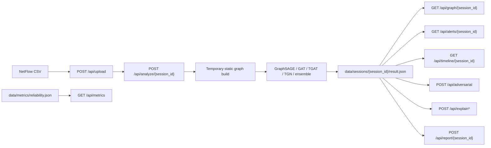

# System Specification: GNN-TGAT-NIDS

> Upload NetFlow traffic -> GNN-based intrusion detection -> interactive graph,
> alerts, reliability metrics, adversarial comparison, explainability, and report export.

**Version:** 1.1.0  
**Status:** Implementation-aligned draft  
**Last Updated:** 2026-06-15

---

## 1. Scope

GNN-TGAT-NIDS is a research and demo system for graph-based network intrusion detection. It combines a Python/PyTorch Geometric ML core, a FastAPI backend, and a Vue 3 frontend.

Primary user workflow:

1. Upload a NetFlow CSV.
2. Start session-based inference with GraphSAGE, GAT, TGAT, TGN, or a static ensemble.
3. Inspect traffic graph, alerts, and attack timeline.
4. Generate a C-PGD adversarial comparison for a selected alert.
5. Export an HTML or PDF report.

Research workflow:

- Build static snapshot graphs and temporal event graphs.
- Train GraphSAGE, GAT, TGAT, and TGN.
- Evaluate clean performance, adversarial training, C-PGD, edge injection, GAN-based adversarial flows, memory poisoning, and explainability.

Out of scope for the current implementation:

- Authentication and multi-user authorization.
- Production deployment hardening beyond local/demo CORS and session cleanup.
- Training through the web UI.
- Explainability for temporal models.
- ONNX export for temporal models.

---

## 2. Architecture


```mermaid
flowchart LR
    CSV["NetFlow CSV"] --> Upload["POST /api/upload"]
    Upload --> Analyze["POST /api/analyze/{session_id}"]
    Analyze --> Build["Temporary static graph build"]
    Build --> Infer["GraphSAGE / GAT / TGAT / TGN / ensemble"]
    Infer --> Result["data/sessions/{session_id}/result.json"]
    Result --> Graph["GET /api/graph/{session_id}"]
    Result --> Alerts["GET /api/alerts/{session_id}"]
    Result --> Timeline["GET /api/timeline/{session_id}"]
    Result --> Adv["POST /api/adversarial"]
    Result --> Explain["POST /api/explain*"]
    Result --> Report["POST /api/report/{session_id}"]
    Metrics["data/metrics/reliability.json"] --> Reliability["GET /api/metrics"]
```

### 2.1 Repository Layout

```text
app/                         FastAPI application
  main.py                    app setup, CORS, model loading, session cleanup
  routers/
    analysis.py              upload, analyze, status, graph, alerts, timeline
    adversarial.py           C-PGD comparison endpoint
    explain.py               GNNExplainer endpoints for static models
    report.py                reports and reliability metrics
    streaming.py             WebSocket streaming inference
  services/
    inference.py             checkpoint loading and model inference
    graph_builder.py         PyG/logits -> Cytoscape + alerts + Plotly timeline
    cpgd_service.py          web wrapper around CPGDAttack
    report_builder.py        Jinja2 -> HTML/PDF

src/                         ML core
  data/                      CSV loading, static graph build, temporal build
  models/                    BaseNIDSModel, GraphSAGE, GAT, TGAT, TGN, ensemble
  attack/                    C-PGD, constraints, edge injection, GAN, memory poisoning
  defense/                   adversarial training
  explain/                   GNNExplainer integration
  eval/                      metrics and FocalLoss
  utils/                     seed and checkpoint helpers

frontend/src/                Vue 3 + Vite + TypeScript frontend
  api/                       Axios API client and response types
  router/                    route table
  stores/session.ts          single Pinia session store
  views/                     Upload, graph, alerts, timeline, reliability, adversarial
```

### 2.2 Runtime State

Session state is file-backed under `data/sessions/{session_id}/`:

```text
data/sessions/{session_id}/
  upload.csv
  status.json
  result.json
  adversarial/{flow_id}_eps{epsilon}_steps{steps}.json
  report.html
  report.pdf
```

`app/main.py` creates the session directory, loads model checkpoints once at startup, and starts a background cleanup task. The default TTL is 3600 seconds and can be changed with `SESSION_TTL_SECONDS`.

---

## 3. Data Pipeline

### 3.1 Static Graphs

Implementation: `src/data/static_builder.py`

The static builder:

1. Loads a NetFlow-style CSV with timestamp and label detection.
2. Encodes labels, with benign/normal as class 0 when present.
3. Splits data chronologically.
4. Fits `StandardScaler` on train features only.
5. Clips raw features at `mean +/- clip_sigma * scale`.
6. Saves both `scaler.pkl` and `scaler.json`.
7. Writes one PyG `Data` object per time window.

Static graph schema:

```text
Data(
  x          = node aggregate features,
  edge_index = directed flow edges,
  edge_attr  = normalized NetFlow features,
  y          = binary labels,
  y_multi    = multiclass labels,
  num_nodes  = node count
)
```

Node identity:

- If IP columns are present, endpoints use `(ip, port)` tuples.
- If IP columns are absent, processed UNSW-style data uses proxy nodes:
  - source: `("src", sttl // 16, proto)`
  - destination: `("dst", dttl // 16, service)`

Default offline static config (`configs/data/static_default.yaml`):

| Key | Value |
|---|---|
| Dataset | `NF-UNSW-NB15-v2` |
| Raw path | `data/raw/NF-UNSW-NB15-v2.csv` |
| Processed dir | `data/processed/static` |
| Label column | `attack_cat` |
| Window size | 120 seconds |
| Split | 60% train, 20% val, 20% test |
| Normalization | z-score, train-only scaler, clip at 3 sigma |

Important current mismatch:

- Offline static training defaults to 120-second windows.
- Web upload inference in `app/services/inference.py` currently builds temporary static graphs with 60-second windows.
- Explainability and streaming defaults also use 60-second windows.

This should be considered when comparing offline training metrics to web-demo behavior.

### 3.2 Temporal Graphs

Implementation: `src/data/temporal_builder.py`

Temporal data uses continuous PyG `TemporalData`, not snapshot windows:

```text
TemporalData(src, dst, t, msg, y)
```

Supported inputs:

- Single CSV through `load_csv`.
- Raw UNSW-NB15 files named `UNSW-NB15_1.csv` through `UNSW-NB15_4.csv`.

Temporal node identity is IP-level and requires source/destination IP columns. Outputs are stored in `data/processed/temporal/{train,val,test}.pt` with `meta.json` and `scaler.pkl`.

---

## 4. Models and Training

All models implement `src.models.base.BaseNIDSModel`:

```python
forward(data) -> torch.Tensor      # per-edge logits, [num_edges, num_classes]
predict_edges(data) -> torch.Tensor
predict_proba(data) -> torch.Tensor
```

### 4.1 Model Configurations

| Model | Config | Main settings |
|---|---|---|
| GraphSAGE | `configs/model/graphsage.yaml` | 3 layers, hidden 256, dropout 0.3, mean aggregation |
| GAT | `configs/model/gat.yaml` | 3 layers, hidden 256, 4 heads, dropout 0.3 |
| TGAT | `configs/model/tgat.yaml` | hidden 172, 2 heads, 20 recent neighbors |
| TGN | `configs/model/tgn.yaml` | memory 172, time dim 64, hidden 256, 20 neighbors, graph attention |

`src/models/ensemble.py` supports static-model ensembles with `soft_vote`, `hard_vote`, and `weighted` strategies. The API accepts `model=ensemble` when at least two static model checkpoints are loaded.

### 4.2 Training

Entry point: `train.py`

```bash
uv run python train.py model=graphsage data=static_default
uv run python train.py model=gat data=static_default
uv run python train.py model=tgat data=temporal_default
uv run python train.py model=tgn data=temporal_default
```

Default training settings (`configs/train.yaml`):

| Key | Default |
|---|---|
| `train.lr` | 0.001 |
| `train.epochs` | 200 |
| `train.batch_size` | 32 |
| `train.use_amp` | true on CUDA |
| `train.loss` | focal |
| `train.focal_gamma` | 2.0 |
| `train.save_every` | 10 |
| `train.val_every` | 1 |
| `train.patience` | 0 |
| `train.adversarial_training` | false |

Class weights are computed from the training split. With `train.loss=focal`, the model uses weighted focal loss; otherwise it uses weighted cross entropy.

Checkpoint outputs:

- Resume checkpoint: `{train.checkpoint_dir}/latest.pt`
- Best training checkpoint: `{train.checkpoint_dir}/best.pt`
- Periodic checkpoints: `{train.checkpoint_dir}/epochNNNN.pt`
- Web inference model: `checkpoints/{model}_best.pt`
- Adversarially trained web model: `checkpoints/{model}_adv_best.pt`

---

## 5. Adversarial Robustness

### 5.1 C-PGD

Implementation: `src/attack/cpgd.py`  
Web wrapper: `app/services/cpgd_service.py`

C-PGD perturbs edge features in normalized space, projects each step through raw-scale protocol constraints, and returns only constraint-satisfying adversarial examples.

```text
x_adv = x + Uniform(-epsilon, epsilon)
for step in steps:
    grad = d CrossEntropy(model(x_adv), target=benign) / d x_adv
    x_adv = x_adv + alpha * normalized(grad)
    x_raw = inverse_transform(x_adv)
    x_raw = ConstraintSet.project(x_raw)
    x_adv = transform(x_raw)
    x_adv = clip(x_adv, x - epsilon, x + epsilon)
return x_adv if ConstraintSet.check(x_raw_final)
```

Web defaults:

- `epsilon = 0.1`
- `steps = 40`
- timeout = 30 seconds
- result cache keyed by `(session_id, flow_id, epsilon, steps)`

Constraint categories in `src/attack/constraints.py`:

- TCP flag validity.
- Feature co-dependency recomputation for byte-rate/throughput fields.
- Feature bounds from scaler statistics.
- Semantic preservation constraints where defined.

### 5.2 Other Modules

Implemented but not all exposed in the web adversarial comparison endpoint:

- Edge injection attack.
- GAN/WGAN-GP adversarial flow generator.
- TGN memory poisoning attack.
- C-PGD adversarial training.

---

## 6. Backend API

All REST endpoints are mounted under `/api`.

### 6.1 Analysis Workflow

| Method | Path | Purpose |
|---|---|---|
| `POST` | `/upload` | Upload `.csv`, create session, save `upload.csv` |
| `POST` | `/analyze/{session_id}` | Start background inference |
| `GET` | `/status/{session_id}` | Poll `idle/analyzing/ready/error` |
| `GET` | `/graph/{session_id}` | Return Cytoscape graph, default max 2000 edges |
| `GET` | `/alerts/{session_id}` | Return paginated alerts |
| `GET` | `/timeline/{session_id}` | Return Plotly-compatible timeline |

Upload constraints:

- `.csv` extension only.
- Maximum size: 50 MB.

Allowed model names:

```text
graphsage | gat | tgat | tgn | ensemble
```

### 6.2 Adversarial

`POST /api/adversarial`

```json
{
  "session_id": "uuid",
  "flow_id": "e123",
  "epsilon": 0.1,
  "steps": 40
}
```

Returns original/adversarial prediction, confidence, raw-scale features, CSR, and changed features. HTTP 408 is returned if generation exceeds 30 seconds.

### 6.3 Explainability

| Method | Path | Purpose |
|---|---|---|
| `POST` | `/explain/{session_id}` | Explain one `edge_idx` |
| `POST` | `/explain-top/{session_id}` | Explain top-K confident alerts |

Only `graphsage` and `gat` are accepted. Temporal models return HTTP 400 for explainability requests.

### 6.4 Reports and Metrics

| Method | Path | Purpose |
|---|---|---|
| `POST` | `/report/{session_id}` | Generate HTML/PDF report |
| `GET` | `/report/{session_id}/download?format=pdf|html` | Download report |
| `GET` | `/metrics` | Serve `data/metrics/reliability.json` or placeholders |

### 6.5 Streaming

```text
ws://localhost:8000/api/ws/stream?model=graphsage&window_seconds=60
```

Client messages:

```json
{"flows": [{"col": "value"}]}
{"command": "flush"}
{"command": "close"}
```

Server messages:

```json
{"type": "ack", "n_buffered": 42, "n_processed": 1000}
{"type": "alerts", "window": 0, "alerts": [], "stats": {}}
{"type": "error", "message": "Invalid JSON"}
```

---

## 7. Frontend

Frontend stack:

- Vue 3
- Vite
- TypeScript
- Vue Router
- Pinia
- Axios
- Cytoscape.js
- Plotly basic distribution

Routes:

| Path | Component | Purpose |
|---|---|---|
| `/` | `UploadView.vue` | Upload CSV and choose model |
| `/graph` | `TrafficGraph.vue` | Cytoscape traffic graph |
| `/alerts` | `AlertList.vue` | Alert table and pagination/filtering |
| `/timeline` | `AttackTimeline.vue` | Plotly attack timeline |
| `/reliability` | `ReliabilityPanel.vue` | Precomputed metrics |
| `/adversarial` | `AdversarialReport.vue` | C-PGD comparison and report export |

`frontend/src/stores/session.ts` is the single Pinia store. It tracks session ID, status, progress, graph nodes/edges, alerts, timeline, reliability metrics, selected flow, and adversarial result. It polls `/status/{session_id}` every 2 seconds and stops on `ready` or `error`.

API base URL is `VITE_API_BASE_URL` or `http://localhost:8000` by default.

---

## 8. Current Experiment Results

The current tracked metrics file is `data/metrics/reliability.json`.

| Model | Clean test F1 | Precision | Recall | ROC-AUC | Notes |
|---|---:|---:|---:|---:|---|
| GraphSAGE | 0.9712 | 0.9792 | 0.9660 | 0.9992 | Static clean metric |
| GAT | 0.9534 | 0.9729 | 0.9433 | 0.9963 | Static clean metric |
| TGAT | 0.9475 | 0.9632 | 0.9391 | 0.9963 | Temporal, 30 epochs |
| TGN | 0.9463 | 0.9610 | 0.9351 | 0.9960 | Temporal, 30 epochs |
| GraphSAGE + adv training | 0.9753 | 0.9803 | 0.9727 | 0.9997 | C-PGD augmented training, eps=0.1, steps=10, ratio=0.3 |
| GAT + adv training | 0.9622 | 0.9696 | 0.9581 | 0.9965 | C-PGD augmented training, eps=0.1, steps=10, ratio=0.3 |

Reliability C-PGD detection-rate metrics currently recorded:

| Model | `dr_under_cpgd_eps01` | Scope |
|---|---:|---|
| GraphSAGE | 1.0000 | sampled static test windows: 16 windows, 104 attack edges |
| GAT | 1.0000 | sampled static test windows: 16 windows, 103 attack edges |
| TGAT | null | temporal C-PGD skipped |
| TGN | null | temporal C-PGD skipped |

Reliability deltas currently recorded:

| Model | `delta_f1_after_adv_training` |
|---|---:|
| GraphSAGE | 0.0041 |
| GAT | 0.0087 |
| TGAT | null |
| TGN | null |

The static C-PGD detection-rate values are sampled because full-test C-PGD over
3312 static test windows is expensive. Use `scripts/compute_reliability_metrics.py`
without `--cpgd-max-windows` to run the full static test split.

---

## 9. Operations

Backend:

```bash
uv sync
uv run uvicorn app.main:app --reload --port 8000
```

Frontend:

```bash
cd frontend
npm install
npm run dev
```

Static data build:

```bash
uv run python src/data/static_builder.py
```

Temporal data build:

```bash
uv run python src/data/temporal_builder.py
```

Tests:

```bash
uv run pytest
```

Frontend build:

```bash
cd frontend
npm run build
```

---

## 10. Known Constraints

- Web upload inference rebuilds temporary static graphs per request; this is acceptable for demo-sized CSVs but expensive for large files.
- Offline static training uses 120-second windows, while web inference/explainability/streaming currently default to 60 seconds.
- C-PGD web comparison builds a minimal single-edge graph with dummy node features. This is useful for reports but not identical to perturbing inside the original full graph context.
- Temporal models can be loaded for inference when checkpoints are present, but explainability and C-PGD web comparison are static-model oriented.
- Web inference loads complete model objects with `torch.load(..., weights_only=False)`, so checkpoints must be trusted.
- `scaler.json` is preferred by C-PGD; `scaler.pkl` remains a fallback.
- Session storage is local filesystem state, not distributed storage.

---

## 11. References

- Hamilton et al., "Inductive Representation Learning on Large Graphs", NeurIPS 2017.
- Velickovic et al., "Graph Attention Networks", ICLR 2018.
- Xu et al., "Inductive Representation Learning on Temporal Graphs", ICLR 2020.
- Rossi et al., "Temporal Graph Networks for Deep Learning on Dynamic Graphs", arXiv 2020.
- Madry et al., "Towards Deep Learning Models Resistant to Adversarial Attacks", ICLR 2018.
- Pierazzi et al., "Intriguing Properties of Adversarial ML Attacks in the Problem Space", IEEE S&P 2020.
- Han et al., "Practical Traffic-Space Adversarial Attacks on Learning-Based NIDSs", USENIX Security 2021.
- Lo et al., "E-GraphSAGE: A GNN-based IDS for IoT", IEEE NOMS 2022.
- Bilot et al., "Graph Neural Networks for Intrusion Detection: A Survey", IEEE Access 2023.
